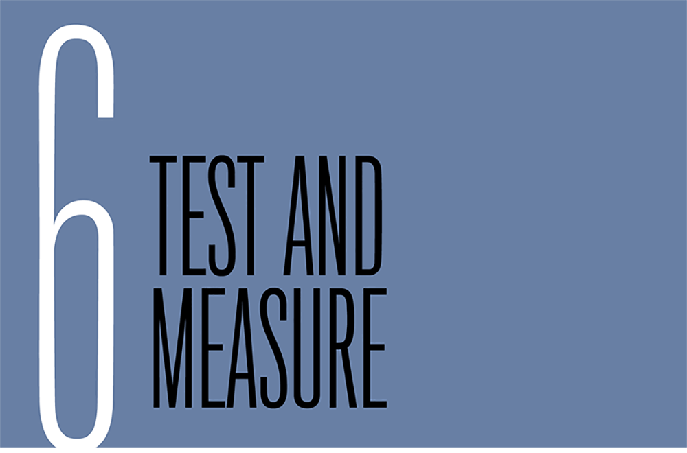
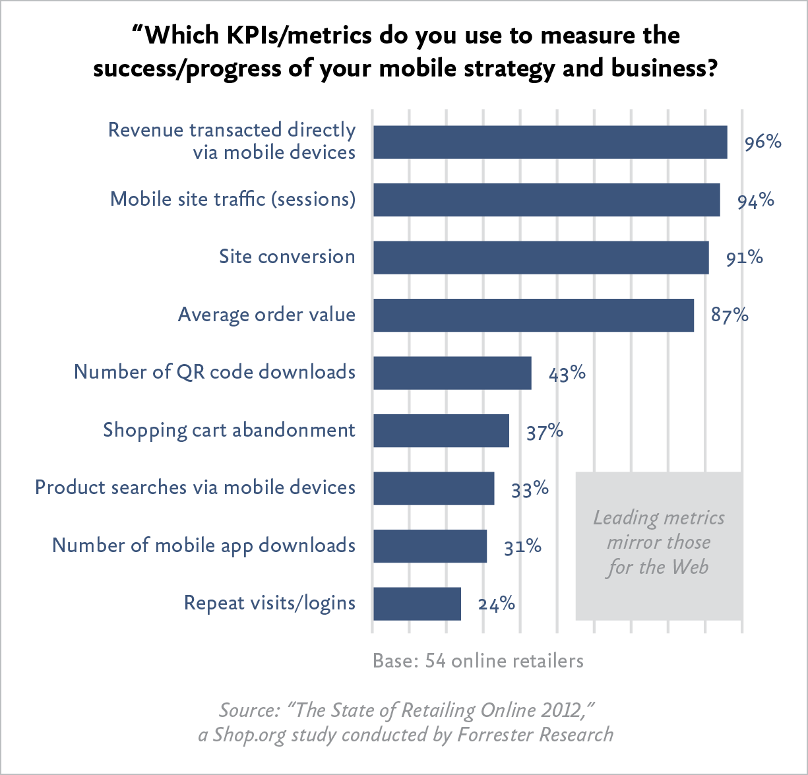

“Every one of these responsive products we’ve rolled out have performed better than the previous products. We’re actually very happy with it.”

—BILL SCOTT, *PayPal (*[http://bkaprt.com/gr/01-52/](http://bkaprt.com/gr/01-52/)*)*

BY NOW, the benefits of a One Web philosophy for responsive design should be clear. Adopting design and development practices that embrace the fluid and flexible nature of the web allows us to avoid making device-specific decisions that add time, cost, and complexity when creating and maintaining the site.

Does that unified approach extend to research, testing, and analytics methods? If only it could be so simple.

In the broadest possible sense, responsive design does enable a holistic view of web success metrics. You want people to read, research, interact, and buy—on whichever device they choose. With responsive design, you can easily evaluate how often users achieve their goals across all devices. By not siloing development effort by device type, you also prevent unproductive competition for time and resources. Success for one platform doesn’t come at the expense of another.

In a narrower sense, success must be evaluated—say it isn’t so—at the device level. Even though the design and code is the same across devices, the user only sees one view. (Most people don’t resize their browser window obsessively, I’ve discovered.) Device and platform-specific testing is needed to refine layouts and interactions—and find bugs. Looking at analytics by device type or platform will give you a nuanced picture of how customers engage with your site, and may help inform advertising and marketing initiatives, or plans for adaptive solutions.

So throw off that One Web banner you wrapped yourself in. (Admit it, it was getting kind of hair-shirty.) When we talk about research and testing methodologies, we must take specific device types into account. When it comes time to ask customers whether the responsive design meets their needs, we’re going back to basics—back to devices.

## TESTING AND SUPPORT

What devices and platforms do you *support*? In a simpler time, that question meant something: “This Page Best Viewed with Netscape Navigator 3.0.” Adoption of web standards led to a world where websites worked pretty much everywhere—and a world where “QA” meant ensuring pixel-perfect layouts across all the various browsers and platforms.

Responsive means adopting a new definition of *support*, one that aims to make sure the widest possible audience can *use* the website, without expecting every user will see the exact same thing. This new definition of support changes how teams think about testing, because rather than looking for pixel-perfect layouts on every platform and screen size, they’re focused on making sure users can complete their tasks—even if the presentation is different on different devices.

Jeremy Keith of Clearleft, describing their work for Code for America, emphasized that *support* does not mean *optimization*—they support everyone, but they don’t optimize for any particular browser or platform:

> We define support as: “Can you accomplish the task?” We think we’ve managed to give 100% support to any web browser capable of accessing the internet. That does not mean they all get the same experience—very, very far from it actually. Pulling it up in the device lab on quite a different range of devices—ancient Android phones, newer Windows phones, iOS devices—it looks quite different on all those devices. That’s not a bug, that’s a feature. It’s good that it looks quite different on a four-year-old phone than it does on a one-year-old phone. It would be weird if it looked the same on both, that would actually be strange ([http://bkaprt.com/gr/05-16/](http://bkaprt.com/gr/05-16/)).

Well-implemented responsive design should function on all devices—even ones that weren’t considered in the design and testing process. A new form factor like the iPhone 6+, a new device like the Android Wear watch, or even—surprisingly—a much older device like the Apple Newton should display a functioning responsive website, even if it looks different on each of those devices (FIG 6.1).

 the ancient Apple Newton during their design and development process. And yet—overlooking a few character encoding problems—the site works (http://bkaprt.com/gr/06-01/).")

There are clear business benefits to thinking this way about device support. Rather than wasting time on ensuring pixel-perfect layouts across devices—an activity that never resulted in much tangible business value—teams focus on building a site that works on every device. Your future-friendly approach means you’re already prepared when a new device comes along.

### Support = testing

Just because teams don’t optimize for a particular device type, screen size, browser, or platform during the design process doesn’t mean the site isn’t tested on actual devices. When we talk about supporting a particular device or browser, that means it’s been identified as a priority for testing.

Monika Piotrowicz from Shopify said, “Support means it works across any screen size and any screen resolution. That’s always something that we’re going to be striving for in a responsive design.” She went on to say that they’re pragmatic in how they test in their device lab:

> Practically speaking, there are a core set of desktop browsers that we support and actively test in. We have a mobile lab of some of the common mobile devices—and some of the less common but finicky mobile devices—that we can test on. We feel this is a good representation of the overall landscape, but you can’t have every device under the sun ([http://bkaprt.com/gr/01-17/](http://bkaprt.com/gr/01-17/)).

### Building a device lab

Great, let’s look at our designs in context to get a sense of how the site performs! Wait, where are we going to get all these devices?

If you’re responsible for leading or overseeing a responsive redesign, you’re responsible for ensuring your team has access to a lab of devices for research, design, and testing. Don’t approach this ad hoc—have a plan for making sure your team can make good design decisions and evaluate performance.

* **Don’t** **rely on** **online emulators** that claim to represent the experience on different devices ([http://bkaprt.com/gr/06-02/](http://bkaprt.com/gr/06-02/)). Emulators won’t give you an accurate picture of how quickly your site renders, nor will they give testers a sense of what it feels like to interact with the device—though they can help for basic research and design purposes.
* **Don’t rely on employees’ personal devices** to compensate for building a device lab. Many companies assume team members will use their personal devices for testing, but don’t expect everyone to bring multiple devices to the office. The success of your redesign shouldn’t hinge on someone’s personal device ownership—and the cost of providing devices is much less than the cost of ongoing testing, bug fixes, and customer support calls.

If you want to do this right, you need to invest in a proper device lab—so I’ll walk you through the basics. For in-depth guidance on managing power, cables, user accounts and permissions, device activation, and lab security, you can find everything you’ve ever wanted to know (and more) in Destiny Montague and Lara Hogan’s presentation on building a device lab at Etsy ([http://bkaprt.com/gr/06-03/](http://bkaprt.com/gr/06-03/)).

#### Selecting devices

Consider establishing a cross-functional team to select which devices to support. Marriott established a “Level of Support” working group with representatives from their research, analytics, content management, design, development, system administration, customer service, and QA teams. Each group might weigh in on the baseline and breadth of devices and platforms to be considered during the testing process. Because every device requires more time from the research and QA teams for testing and device-switching, the cost in increased time and effort should be considered when defining which devices will be supported.

Build your device lab gradually, and expect to purchase a good mix of devices. Smaller organizations may plan to acquire eight to ten devices to cover the basics, while larger organizations could collect twenty or thirty. Focus on the most common devices and device types, but make sure you’re seeing the full range of platforms, OS versions, screen sizes, and input modes. Your analytics data should tell you—with an acceptable degree of accuracy—which devices are most popular. From there, make sure you’re getting a good cross-section of:

* **Device types.** You’ll want examples of smartphones and tablets, of course. Some teams may need to test on e-readers, televisions, or gaming systems—all of these may come with a built-in browser.
* **Operating systems.** You’ll want examples of iOS, Android, Blackberry, Windows, and (Kindle) Fire OS. Depending on your audience, you may want examples of Firefox OS, Symbian, Bada, Ubuntu, webOS, and \[insert your favorite open-source operating system here\]. Don’t forget about devices running desktop OS, like Microsoft Windows Surface or Chromebook. For Android in particular, and iOS to some extent, you’ll need new and old versions of the OS running on high- and low-end devices.
* **Screen size and DPI****.** You’ll want a good range of screen sizes, from the smallest watch or smartphone up through large tablets and even TVs. You’ll also benefit from having access to HD or Retina displays and standard resolutions.
* **Input modes.** While touch will be the primary input mechanism you’ll need to test, be sure you have devices with hard and soft keyboards, as well as remote controls—even trackpads and mice. Don’t forget to test on screen readers for the blind, too.
* **Browsers.** Remember you can install multiple browsers on each device for cross-browser testing.

Building a device lab may seem daunting and costly, but it doesn’t have to be. Basing your device lab on older devices gives a more accurate picture of real-world speed and battery life—and it means you can build your device lab inexpensively. You can purchase used devices from eBay or other resellers. Some mobile phone retailers will let you purchase older devices at a discount. Team members may be willing to donate their old devices when they upgrade—consider offering them a gift card in exchange.

#### Making devices available

Making the device lab open and available to everyone means it will be used more often for reviews and collaboration. Rather than locking up devices in a cabinet, ensure that team members can easily check them out. (Use RFID tags to track device checkouts and assume there will be some loss and breakage.)

Testing across devices takes time, so give your team the tools they need to get the job done. Researchers and testers need priority access to the lab. Designers and developers should have at least two devices available to them throughout the process—most likely iOS and Android devices, in both smartphone and tablet form. While employees’ personal devices are often the first line of defense for testing work-in-progress, encourage your team to check their work on older, less capable devices. And bring a variety of devices to meetings with stakeholders.

### Usability testing

As with every web design project, you should plan to usability test your responsive designs throughout the process. Teams that have embraced an iterative process with regularly scheduled user studies will see the payoff in their responsive project. Teams that haven’t adopted this way of working should consider moving to this model—not just for the responsive redesign, but because frequent user studies result in better designs.

If you’re not already convinced that prototyping is the best and fastest way for teams to collaborate, another advantage of responsive prototyping is that you’ll already have what you need to support usability tests. Participants can even bring up the prototype on their own devices, which makes the experience more personal and avoids some of the discomfort or inaccuracy with using lab computers.

When recruiting users for usability tests, you may wonder if you need to recruit three times as many people—say, eighteen rather than six users to cover smartphone, tablet, and desktop views. If you’re conducting tests on a regular basis, this won’t be as much of an issue—just prioritize the testing scenarios that require the most attention. If you’re saving everything up for one or two big tests, plan to recruit a larger pool of users. If users look at multiple devices in a single session, randomize the order in which they see each one.

While the basic guidelines for research and testing stay the same, there are a few new tricks to consider when testing responsive sites:

* Content prioritization exercises can be conducted with users too. Like the stakeholder exercises in Chapter 4, you can ask users to rank information on the page or arrange content modules with Post-its. Keep it simple, since users will be less familiar with the content than business owners.
* Content choreography should be evaluated with potential users, especially when reviewing early-stage prototypes. Ask participants to review the site on smartphone, tablet, and desktop form factors; randomize the order in which they see each one.
* Don’t be afraid to make changes to the prototype during the testing process—that’s one of the perks of working iteratively.

### A/B testing

Split testing or multivariate testing can greatly simplify—or complicate—the process of evaluating a responsive design.

A/B testing can make it faster and more accurate to evaluate changes. Rather than waiting for a round of usability testing, organizations like Expedia and Airbnb often run tests on the live site. Teams that have implemented a pattern library and componentized framework on the backend report that they were able to launch and test individual components gradually, without waiting for the site to fully launch.

Similarly, A/B tests may be used to evaluate and refine changes to the site content. Often, these tests are used to evaluate different marketing messages or promotional offers, but could also be used to test calls to action or even different content structures and navigation. If you’re interested in testing mobile-specific landing pages or campaigns, you may wish to consider adaptive solutions over responsive templates ([http://bkaprt.com/gr/06-04/](http://bkaprt.com/gr/06-04/)).

Keep in mind that a performance cost comes with running A/B tests. While this delay may be relatively unnoticeable on fast desktop networks, users on mobile devices may suffer disproportionately, which can affect the results of the tests.

### QA testing

Gridset conducted surveys in 2012 and 2013 to understand responsive design workflow (FIG 6.2). Both years, testing and QA was the number one reported challenge, with 49% of respondents saying it was their biggest pain point ([http://bkaprt.com/gr/06-05/](http://bkaprt.com/gr/06-05/)).

.")

I won’t sugarcoat it: QA testing of responsive designs will take longer and will likely cost more than testing fixed-width desktop sites. While design and development processes will speed up and stabilize—building responsive websites won’t always take longer—companies should assume that the QA process will remain a pain point. Er, I mean, it will remain an *exciting challenge*. Running tests against different devices, orientations, and breakpoints simply takes more time.

Give your team and your process a break by not logging more bugs than necessary. Focus on what really matters:

* **Test scripts** should primarily evaluate whether it is possible for a user to complete a task. Required information should be available, text and images should be legible, and users should be able to progress through the transaction flow.
* **Visual QA** should ignore differences between platforms—layout, size, and styling will, by definition, be different. Testers will need a way to reference expected look-and-feel on various form factors, but the baseline for acceptability should be whether users can complete their task.
* **Prototypes** don’t require the same level of support or scrutiny. Stakeholders may find that the prototype doesn’t work as expected on lower-end Android devices (or Internet Explorer), and that’s okay.

## EVALUATION

While the ethos of responsive design embraces a fluid, flexible approach to designing across devices, most organizations will look at analytics and business metrics through the lens of device types, at least in the near term. Livia Labate from Marriott explained that they review analytics by device categories, even though their design process focuses on breakpoints:

> We break down our analytics data across three main categories: smartphones, tablets, and everything else. That’s just for reporting purposes. When we talk about design we don’t use this language; instead we talk about breakpoints, because that level of granularity makes sense for the design process ([http://bkaprt.com/gr/01-53/](http://bkaprt.com/gr/01-53/)).

Today, organizations want data that shows whether responsive designs are effective for different device types, whether there are problems or bugs at certain breakpoints, and whether they should invest in additional design or development for emerging or popular devices or form factors.

You know what else they want? Data that shows huge growth for key performance indicators on smartphones and tablets. If you’ve ever been in a meeting where an executive proclaimed an “eleventy bajillion percent increase in conversions on mobile!” you know that percentage increases on very small numbers can make reports look spectacular. Stakeholders will see political benefits from reporting large percentage increases on mobile.

Over the long term, it’s likely that segmenting by platform will be less relevant to business goals. There will be no need to pit smartphones and tablets against the desktop (FIG 6.3). Rather than treating mobile as if it’s a completely different animal, Forrester has found that the metrics used to evaluate success on mobile are the same as overall web metrics ([http://bkaprt.com/gr/06-06/](http://bkaprt.com/gr/06-06/)).

### Metrics

Typically, when embarking on a responsive redesign or evaluating its performance after launch, companies look at the following metrics—often by device type and by OS:

* **Visits****.** The most common metric cited is the percentage of visits coming from mobile—often presented as smartphones plus tablets in aggregate. While this number varies by industry, it’s not uncommon today for companies to see 50% of their traffic coming from mobile devices—and that number should go up after launching a responsive site. Companies with smaller percentages of visits from mobile—say, 10 to 20%—are likely to see those numbers double when they launch a responsive site.
* **Bounce rate.** Bounce rate is another metric that gives a sense of user satisfaction and engagement on mobile. Users hitting a desktop-optimized page from a mobile device are more likely to leave the site immediately. Outside Magazine said their homepage bounce rate on smartphones was around 75% before their responsive redesign, but it dropped by 40% after they went responsive ([http://bkaprt.com/gr/06-07/](http://bkaprt.com/gr/06-07/)).
* **Time on site****.** Engagement metrics like time on site should always go up, right? Not necessarily. While many sites will declare success when they see visitors spending more time reading articles or doing research, others may find that a responsive redesign helps users get in and get out quicker. Outside Magazine found that their time on site went *down* after a responsive redesign, because users weren’t wasting time pinching and zooming. According to site director Todd Hodgson, “they’re going to spend less time on your site because they’re not battling your site, and that’s a good thing” ([http://bkaprt.com/gr/06-07/](http://bkaprt.com/gr/06-07/)).
* **Page views.** Like time on site, page views may reflect users’ genuine interest and engagement with the website—or a struggle to find the information they need. In the case of publishers, page views and their associated ad revenue are the primary goal. Scher Foord, Executive Director, Design at Condé Nast, said, “As we relaunch these responsive sites, we have seen tremendous upticks in uniques and page views for our mobile and tablet sites. We’ve seen two to three times the growth on mobile and tablet with a very consistent desktop metric” ([http://bkaprt.com/gr/06-08/](http://bkaprt.com/gr/06-08/)).
* **Repeat visits.** It’s not enough to get users to visit the site once—in many cases, repeat visits are the real sign that people find the site useful. Capital One found that their repeat visits on mobile devices increased tenfold after their responsive redesign launched ([http://bkaprt.com/gr/01-39/](http://bkaprt.com/gr/01-39/)).
* **Referrals.** Many sites find that their traffic increasingly depends on social referrals (and to some extent email referrals) in addition to organic search. With Facebook, Twitter, Google Search, and email all tipping to a majority of mobile users—each of those platforms sees about 50% of traffic from mobile devices—a responsive website can help companies capitalize on valuable referral traffic. MTV responsively redesigned several of their properties with the intention of capturing more traffic from social channels. This work paid off in spades for the redesign of their show pages, which saw an increase of 246% in social referrals, and an eye-popping 565% increase in social referrals to MTV News ([http://bkaprt.com/gr/06-09/](http://bkaprt.com/gr/06-09/)).
* **Conversion rate.** Whether measured by actual sales or lead generation, this number should obviously go up. A report from Econsultancy stated, “I have yet to hear about a decline in conversion rates following the rollout of a responsive site” ([http://bkaprt.com/gr/06-10/](http://bkaprt.com/gr/06-10/)). Eoin Comerford, CEO of retailer Moosejaw, reported that their complete responsive design achieved a 50% conversion rate on mobile devices, matching what they see on desktop. He reminds other businesses: “You can’t accept that mobile conversion is poorer than desktop conversion and that’s just the way it is; you really do have to continually optimize for it” ([http://bkaprt.com/gr/06-11/](http://bkaprt.com/gr/06-11/)).
* **Revenue.** These other metrics are merely a proxy for what *really* matters to the CEO, which is increased revenue. Whether through direct sales or ad revenue, a responsive redesign should deliver real value. Skinny Ties, a family-owned and operated neckwear retailer, saw their overall conversion rate increase by 13.6% after a responsive redesign—almost 72% on iPhone, leading to 42.4% revenue growth across all devices, and 377.6% revenue growth on iPhone ([http://bkaprt.com/gr/06-12/](http://bkaprt.com/gr/06-12/)). Emily Smith, formerly Senior Vice President, Digital at the *Los* *Angeles Times,* explained that there were a “handful of new advertisers that we could never win on our old site, but that have—in some cases—made six-figure ad buys with us post-launch because we have such a better environment for their campaigns” after their responsive redesign ([http://bkaprt.com/gr/06-13/](http://bkaprt.com/gr/06-13/)).

### Success stories

All this from a responsive redesign… Really? Well, maybe not. Successful responsive redesigns encompass so much more than fluid grids, flexible images, and media queries. By prioritizing information and features to meet user goals, streamlining design and functionality, and improving download speed, your site just works better. Mark Grannan, Application Development and Delivery Analyst for Forrester Research, cautioned that it’s difficult to peg all these benefits directly to a responsive redesign:

> So the question becomes: how do you attribute your increased traffic, conversions, or revenue to a single philosophy investment like RWD? The realistic answer: you don’t. Instead, recognize that RWD is a facet of the overall shift to digital business operations and multichannel customer experience, while 
> you focus on driving the most value for your customers 
> and your organization ([http://bkaprt.com/gr/01-25/](http://bkaprt.com/gr/01-25/), PDF, requires purchase).

Responsive design’s benefits go beyond conversions and revenue growth. While those metrics are the most trackable—and are certainly key indicators of the health of the website and the business—there are other ways to evaluate success.

Nationwide reported that their salespeople are excited to talk to potential customers about their new responsive website and they’re seeing an increase in sales as a result. Kevin Ackley, Specialist, Design and Usability at Nationwide, also said that the accolades they received from a powerful industry analyst made a huge impact on the company:

> DALBAR is a market research firm in the financial industry. About three months after we went responsive, they came out with their quarterly review of financial websites. We went from—I don’t think we were even ranked before that, to be honest with you—to number one in retirement plans with an Excellent rating. We’re the only company with an Excellent rating right now ([http://bkaprt.com/gr/04-05/](http://bkaprt.com/gr/04-05/)).

A responsive redesign may also help reduce calls to customer support. By making transactions simpler to begin with—and enabling online customer service—expensive call center time can be reduced. Mike Donahue from Citrix said that they saw an immediate reduction in customer support costs:

> Another way that we’re trying to measure it is on the support side. Two of the key metrics we target are reducing call volume to the call centers and increasing the number of people entering tickets online. I’m happy to say the success of that has gone way beyond what we thought it would be. Phone call volume was reduced by 21%. Opening tickets online instead of phone calls has gone up nearly 50% in just the first thirty days. We weren’t expecting that for probably three to six months, so we’re really, really happy ([http://bkaprt.com/gr/01-19/](http://bkaprt.com/gr/01-19/)).

Perhaps the best benefit from a responsive redesign? Making sure that everyone gets access to the information they need, on whatever device they happen to use. 60% of visitors to AIDS.gov are on mobile devices. Miguel Gomez, Director of AIDS.gov from the Office of HIV/AIDS Policy, US Department of Health and Human Services, put it succinctly: “Responsive design is a tool to help the user.” He continued:

> Responsive design is one of the tools to help us constantly move forward, be faster, and get critical—not to sound dramatic—but get lifesaving information to people when they need it ([http://bkaprt.com/gr/06-14/](http://bkaprt.com/gr/06-14/)).

Dozens of organizations report that a responsive redesign delivers value. Responsive solutions help create a more collaborative process, are easier and less costly to maintain over 
the long term, perform better in search, and lead to more satisfied customers and increased business value according to 
the metrics that matter most. Sounds like a worthwhile investment to me.
