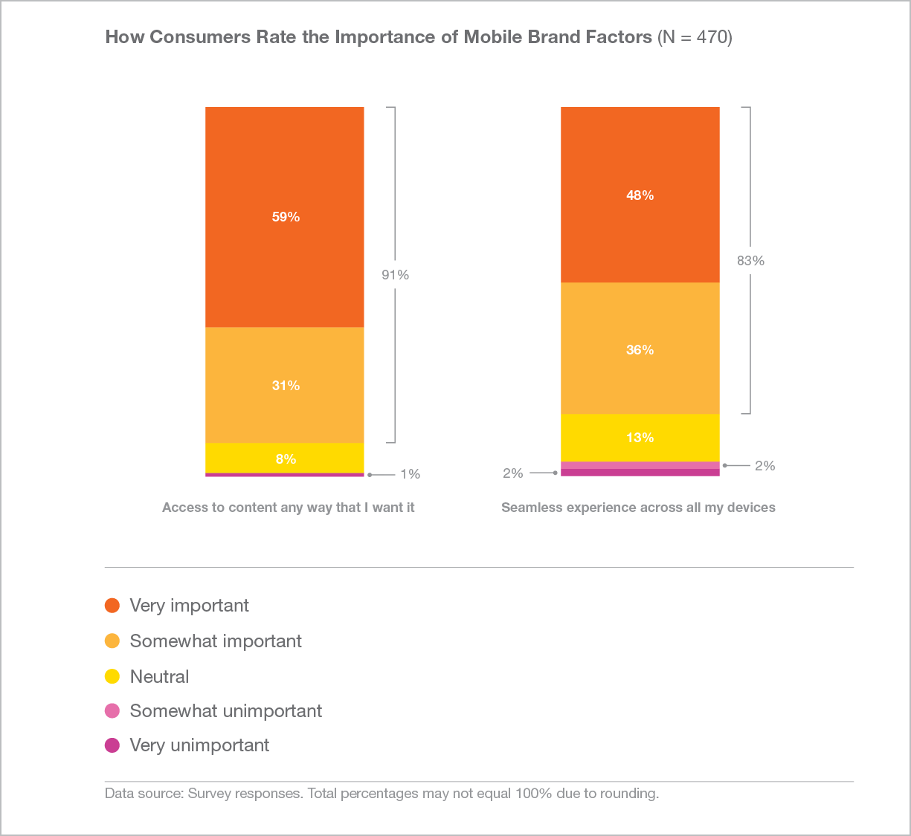
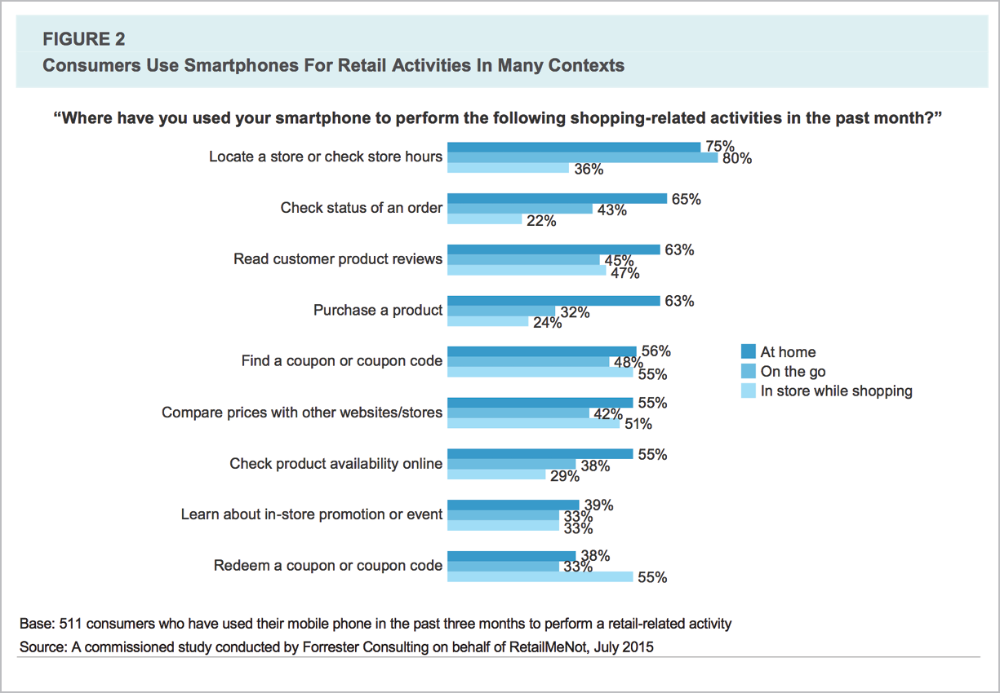
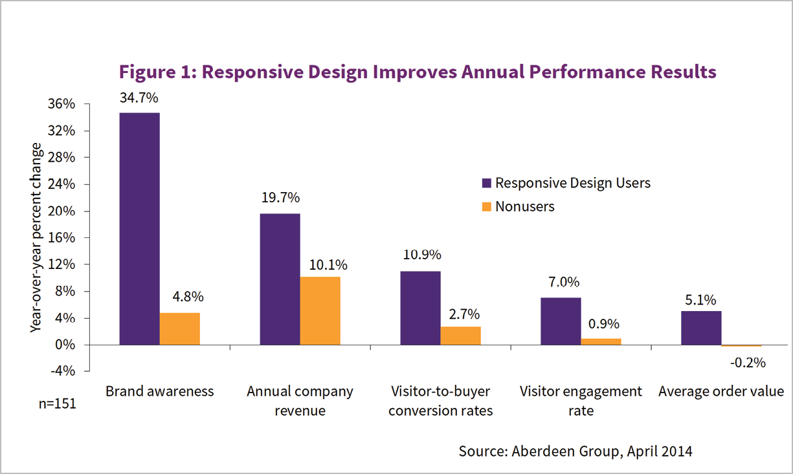
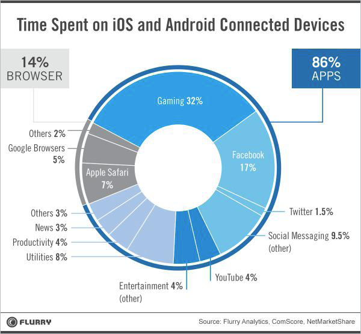
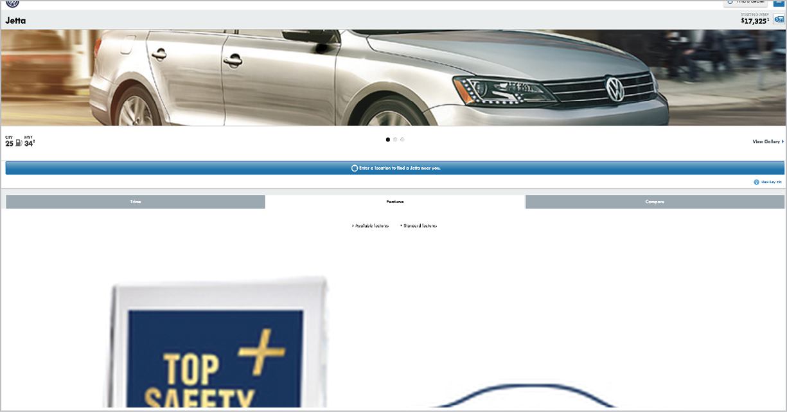

“You’ve probably heard this before, but it really was a no-brainer to go responsive.”

—SARAH THOMPSON, *Seventh* *Generation* ([http://bkaprt.com/gr/01-01/](http://bkaprt.com/gr/01-01/))

ONE OF THE MOST common ways I hear people describe the decision to go responsive is “it was a no-brainer.” For many organizations, it’s less a question of whether to go responsive than a question of *when* and *how*.

Other teams are less confident in making this decision—which is understandable, since the choice to go responsive will affect people and processes throughout the organization. What about alternatives to responsive design, like a separate mobile website or native apps? Will a responsive website be able to meet the potentially differing needs of “mobile” and “desktop” users? Will responsive design be more difficult or costly to implement—and is it worth it? Convincing the interested parties that responsive design is the way to go may be a project in itself.

Whether your organization is convinced that responsive design is the right solution or you’re still trying to make the case, the decision is never actually a “no-brainer.” Understanding how responsive design will fit into your overall digital ecosystem will help you frame the benefits and plan for risks. And understanding that responsive design isn’t an all-or-nothing prospect—but in fact plays nicely with strategies that also include native apps and even adaptive solutions—will help resolve some difficult debates and keep decision-makers focused on the goal at hand, which is building a website that works across platforms.

Even teams that have bought into responsive design as an approach say they need to spend time building a shared understanding of what responsive means and how they will work differently. Every organization should invest some time at the start of the process understanding how a responsive redesign will fit into their broader digital lifecycle and revenue model. Even if it *seems* like a no-brainer, a little strategic thinking now will pay off later.

In this chapter, we’ll look at arguments for and against responsive design. Even if your mind is made up to go responsive, you’ll probably come up against these debates with your team, so it’s worth understanding the pros and cons.

## WHY GO RESPONSIVE?

Let’s assume your organization is already convinced that mobile is important. If you’re still fighting that battle, turn to the comprehensive research in *Mobile is Eating* *the World* from Benedict Evans, partner at Andreessen Horowitz, for all the data you’ll ever need to explain why mobile is mandatory ([http://bkaprt.com/gr/01-02/](http://bkaprt.com/gr/01-02/)).

The question then becomes: “Why go responsive?” Why should you build a single website that fluidly serves all devices? (You can arm yourself with talking points in both PowerPoint and PDF formats: [http://bkaprt.com/gr/01-03/](http://bkaprt.com/gr/01-03/)).

### Device diversity has exploded

Who knew fixed-width design was so easy? Back when we started advocating for web standards, we had two major platforms, maybe three or four browsers to consider. We could get away with designing for one primary screen resolution. Those halcyon days are gone, and they’re never coming back.

Fragmentation of device types, browsers, and screen sizes on mobile means that we’ve leveled up in complexity. Today, we’re designing for smartphones, tablets, and desktop computers. Soon, we may be dealing with emerging form factors like watches, interactive televisions, or headsets. The sheer diversity of new devices—with their endless variety of operating systems, form factors, input mechanisms, and functionality—means that we must let go of device-specific design decisions and take a more holistic view. In *Responsive Web Design,* Ethan Marcotte wrote:

> Responsive design is not about “designing for mobile.” But it’s not about “designing for the desktop” either. Rather, it’s about adopting a more flexible, device-agnostic approach to designing for the web ([http://bkaprt.com/gr/01-04/](http://bkaprt.com/gr/01-04/)).

You didn’t think people were buying all these new devices and not using them, did you? Many websites today see around 50% of their traffic from smartphone and tablet devices (FIG 1.1). That number has increased dramatically over the past few years—and it’s never going back down. (Look at your own analytics data to see how these the numbers shake out.)

Our love of mobile devices has somewhat surprisingly not come at the expense of desktop use. The amount of time 
we spend on desktop or laptop computers (roughly two and a half hours per day) has remained consistent, even as mobile 
use has skyrocketed. Time we spend with mobile devices 
has taken away from time we spend with print media—and probably family time, exercise, and sleep—but not desktop computers (FIG 1.2).

.").")

Device fragmentation is here to stay—we will never again live in a world where we can design for one screen size. (Well, we never lived in a world where everyone looked at the web in the same way: we just pretended we did because it made our lives easier.) It’s time to give up this consensual hallucination that we can plan designs around a single screen size—or even a few different fixed-width layouts.

### Tailoring to the device is harder than it seems

During our workshops, Ethan Marcotte asks: “What are the three most common words used during a responsive design project?” The answer: *mobile, tablet,* and *desktop*. Teams can easily spend hours obsessing over these form factors. But, Ethan goes on to say, these are the three *least helpful* words to use during the design process.

Because we want to provide the best possible experience on the three most common form factors, it makes instinctive sense to try to tailor the experience to the device type. In this case, though, our intuition is wrong.

It’s quite difficult—if not impossible—to accurately determine the type of device or browser from the client side. Sounds crazy, right? It’s one of the most unintuitive aspects of defining a mobile strategy. It seems like the one thing we should be able to know with certainty is the type of device someone is holding—or at the very least its make and model—but manufacturers and browsers don’t make that easy. Devices don’t broadcast “I’m a tablet!” over the internet.

Even the information we *can* get is an unreliable stand-in for device type:

* **Physical screen size** does not necessarily tell us what type of device it is. It’s tempting to assume that smaller screens are smartphones and larger screens are desktops or laptops, but with larger phones becoming more popular, where do you draw the line between a smartphone and a tablet? If you think you can design for a fixed-width screen size on smartphones, just remember all the times you’ve rotated your phone.
* **Pixel density** also varies across devices. The same physical form factor may have double the pixels—as in a Retina display—so the object in the user’s hand may appear smaller than its physical screen dimensions (FIG 1.3). Some high-definition smartphones have higher screen resolutions than laptops. (Fun fact: iOS *icons* are now larger than the *entire* *screen* of the original Macintosh computer.).")
* **Input modes** may seem like a way to identify different device types—smartphones and tablets use touch, while laptops and desktops use a keyboard and a mouse. But as with so many other aspects of mobile devices, input cannot be detected reliably. With more smartphones using styluses and laptop computers offering touch input—not to mention that one guy I saw at the airport with a keyboard, mouse, and external hard drive attached to his Android tablet—it’s risky to think we can assume anything about device type from input modes.
* **Connection** **speed** doesn’t really tell us anything about the device or its capabilities. (And—I’m beginning to sound like a broken record here—we have no reliable way to detect connection speed on the client side.) It’s tempting to think we might send a scaled-down version of the website to slower devices, presuming that they’re smartphones on cellular networks. I’m a frequent traveler, and I can confirm that hotel and airplane Wi-Fi on my laptop often rivals the slowest cellular speeds.
* **User agent detection** seems like a reasonably good way to determine device type. Developers can detect the browser from the *UA string*. But user agent detection is unreliable, because there are characteristics you can’t determine from the UA string. (For example, you can’t tell the difference between an iPad and an iPad mini, or between iPhones with different pixel densities.) Even Google says that relying on user agent detection “is generally an error-prone technique” ([http://bkaprt.com/gr/01-08/](http://bkaprt.com/gr/01-08/)). “Browser spoofing” is a common practice—browsers sometimes lie in order to trick web servers into sending them information they might not see otherwise. Imagine your HR department mandated the company intranet only be used on Windows and Internet Explorer, even though the site would work fine in other browsers. Browsers learned to lie and say they’re IE. Today, Samsung has no incentive to let you make a website that only works on iOS devices—even websites that say they’re “Made for iPad.” It’s a tough thing to accept, but browsers are probably lying to you (FIG 1.4)..")
* **Device detection libraries** like WURFL or Netbiscuits provide the ability to identify device types and capabilities—but at a price. Relying on solutions that require you to pay for access to a proprietary library are risky—especially since there are alternatives that don’t require device detection. (We’ll dive into the risks of device detection a bit more in an upcoming section on managing a separate mobile website, also known as an *m-dot site*.)

Our inability to reliably and accurately know what type of device someone is holding makes designing and developing for specific device types quite difficult—if not impossible.

In fact, the only thing we can *reliably* know is the size of the browser window. That’s it!

Great news: that’s all we need. One of the strongest arguments for responsive design is that decisions about how to present information revolve around what we can actually know about the screen size and capabilities of the device. Based on that information, responsive design ensures that the website renders fluidly and readably in relation to the size of the browser window. Rather than basing our decision-making and design processes on fragile or inaccurate assumptions about device types, responsive design ensures that the site will work on every screen size.

### Users want and need the same information on all devices

Even if determining device type is difficult, surely we should make every effort to provide the best user experience, right? In conference rooms everywhere, teams debate whether “mobile users” and “desktop users” need different content, features, or navigation—different experiences for different devices. Because a responsive approach means sending essentially the same website to everyone, regardless of device, an argument that mobile and desktop users have distinct needs is often an argument against responsive design.

Trouble is, that gut instinct that mobile users need something different isn’t necessarily backed up by research or data. Companies waste a lot of time trying to imagine how what a smartphone user wants differs from what a desktop user wants. Responsive design makes that decision a snap—just serve the same website to everyone.

Turns out users don’t want *you* to decide what they get on which device (FIG 1.5). They want what they want when they want it—a seamless experience across devices, according to this study by ExactTarget (now Salesforce Marketing Cloud) ([http://bkaprt.com/gr/01-10/](http://bkaprt.com/gr/01-10/), PDF):

> By far, access to content “any way I want” is consumers’ most important criteria when rating mobile brand experiences. In fact, 91% of consumers say access to content any way they want is important to them. 83% of consumers also say a seamless experience across all their devices is important to them—and this number increases when considering just those who own both a smartphone or a tablet (87% of consumers who rated this factor as important owned both devices).

The device doesn’t tell you anything about the user’s context or intent. Have you ever used your smartphone while sitting on your couch—or at your desk, within arm’s reach of your computer? Of course you have. Google reports that 77% of mobile searches take place at home or at work—not on the go ([http://bkaprt.com/gr/01-11/](http://bkaprt.com/gr/01-11/)). Why would someone want different search results or information simply because they picked up the closest device within reach?

People also need the same content and functionality on each device because they use multiple devices to complete a task. Have you ever started researching or shopping on a mobile device, then completed the task or transaction later on your desktop? Google reports that 90% of people start a task on one device, and complete it on another ([http://bkaprt.com/gr/01-12/](http://bkaprt.com/gr/01-12/), PDF). As you might expect, people regularly do this kind of device-switching for common activities, like browsing the internet (81%) or social networking (72%). Certain categories like retail (67%), financial services (46%), and travel (43%) also seem to support this type of sequential use of different devices. Why should they get different information—or different offers or discounts—on different devices?

Cross-device behavior in people who own multiple devices is one argument for serving the same content and functionality to everyone, but what about the needs of mobile-only users? Pew Research found that 15% of smartphone-owning Americans have few options for going online other than mobile ([http://bkaprt.com/gr/01-13/](http://bkaprt.com/gr/01-13/)). Why should they be treated like second-class citizens and not be given access to the same information and services as desktop users?

Industry-wide trends are one thing, but what if your company is different? It might be—but it probably isn’t. When companies across every industry look at their data, they find that people look for the same information and complete the same tasks on every size of device.

#### Enterprise corporations

Enterprise businesses—even those with complex service offerings—report that user needs are, in fact, not all that different between mobile and desktop. After evaluating user behavior across devices, Chris Balt, Senior Web Product Manager at Microsoft, reported:

> Our data shows us quite plainly and clearly that the behavior of people on mobile devices is really not all that different than the behavior of people on the desktop. The things they are seeking to do and the tasks they are seeking to accomplish are really quite the same ([http://bkaprt.com/gr/01-14/](http://bkaprt.com/gr/01-14/)).

Rather than wasting time debating how the needs of mobile and desktop users were different, Microsoft decided it would be faster and easier to deliver the same experience to everyone using responsive design.

#### Publishers

News organizations like Quartz have also found little difference in behavior between mobile and desktop users. Regarding the mobile-versus-desktop debate, Zach Seward, VP of Product and Executive Editor at Quartz, said, “We worried about this more in the past, that there was a big difference, and frankly I don’t know that there really is one. They are the same people, just at different parts of their day” ([http://bkaprt.com/gr/01-15/](http://bkaprt.com/gr/01-15/)). While publishers have data showing that people prefer different devices at different times of day, that’s not an argument for delivering different content to mobile and desktop users. Given that budgets are tight, valuable resources should be spent on editorial processes and infrastructure upgrades that provide more value than device-specific targeting.

#### Financial services

Financial services firms like Fidelity have moved away from the mindset that “no one will ever want to do that on their phone.” Based on careful analysis of their data showing how customers use different devices to transact with Fidelity, Stephen Turbek, SVP, User Experience Design, concluded: “We’ve been pleasantly surprised by people’s willingness to complete complex financial transactions on all the form factors, even on a phone” ([http://bkaprt.com/gr/01-16/](http://bkaprt.com/gr/01-16/)). Rather than try to pick and choose the subset of features they imagined a “mobile user” would want, they implemented responsive design to give everyone equal access to everything.

#### Retail

Retailers may fret about offering different experiences to shoppers at home and in stores. Monika Piotrowicz, Front-end Development Lead at Shopify, said that’s not how the company thinks about user needs and goals:

> I don’t think that users on different devices have fundamentally different needs, requirements, or experiences. What’s much more important to us is to look at pages and the specific goals any user may have on that type of page, rather than starting that conversation with, “Is the user on a mobile or a desktop device?” ([http://bkaprt.com/gr/01-17/](http://bkaprt.com/gr/01-17/)).

Responsive design provides a foundation that allows anyone—anywhere, on any device—to do research and complete transactions.

Research from Forrester found that for shoppers, the smartphone is now the primary device they use to interact with retailers in every context (FIG 1.6). Shoppers perform a variety of retail tasks at home, on the go, and in stores ([http://bkaprt.com/gr/01-18/](http://bkaprt.com/gr/01-18/), PDF).

#### Intranets

Company intranets might seem like a clear-cut case for offering different content to mobile and desktop users—after all, the primary use case will be employees sitting at their company workstations. Mike Donahue, User Experience Architect at Citrix, led the design of their responsive intranet. He spent time explaining to the team that it was more important to focus on meeting user needs, regardless of platform, rather than to say “they’re only going to do this if they’re on desktop”:

> You just don’t know what people are going to need at any given point in time. To get people to understand that, one of the use cases we shared was one of our managers. His wife had gotten sick and had to go to the hospital. Suddenly he needed some information about his insurance, and he couldn’t get to it while he was not connected to the network at the office ([http://bkaprt.com/gr/01-19/](http://bkaprt.com/gr/01-19/)).

#### Travel

Even travel companies—the most “mobile” use case that exists—report that they don’t necessarily see the need to tailor the experience to the device. Scott Kelton Jones, VP, Global User Experience Design at Expedia, said, “I believe that people will do anything on any device if you give them the functionality and you make it easy enough.” That belief, he continued, has been confirmed by their research and testing:

> What we’ve discovered as we do our ethnography research, our lab studies, as we watch the mechanics of our sites from an analytics perspective: people make the same decisions regardless of the context ([http://bkaprt.com/gr/01-20/](http://bkaprt.com/gr/01-20/)).

Virgin America, Airbnb, and Marriott all report that responsive design makes it possible to deliver a consistent experience to users, whether they’re sitting in their home office or in the front seat of a car.

Debating whether mobile and desktop users need different information is a distraction. Treating everyone equally is not only easier and more efficient, but it also delivers more value to the organization—and to the customer. Users want and need the same information on every device they own. Responsive design is the simplest way to deliver the best experience.

### A single website is easier to maintain

“Sure, maintaining multiple versions of our website sounds like a great way to use our limited resources!”—said no one, ever. Most web teams I know are resource-constrained, and there’s never enough time or money to do all the things they wish they could do.

Responsive design also provides a better experience for the team responsible for building and maintaining the website. Tina Alexander, formerly Director, Product Development for Time.com, explained that reducing the burden on an already overworked web staff was the main selling point when she led the responsive redesign of Celebrity Cruises:

> We think about how we optimize our resources and we usually don’t have enough. This has been true of everywhere I’ve worked. We had to say, “What’s the best way to get the biggest bang for our buck?” A framework of responsive web gave us the opportunity to respond more quickly to device changes and to make sure our content was updated across all platforms. Reducing the management costs and maintaining a more consistent presence was perhaps the most winning point we made in our discussions ([http://bkaprt.com/gr/01-21/](http://bkaprt.com/gr/01-21/)).

Responsive design concentrates your efforts, unifying development into a single codebase. Your entire team is pulling in one direction, rather than being fragmented across platforms and device types. Your investment goes further, enabling greater focus on developing new features—not to mention testing and refining existing experiences—because you’re not splitting your attention and resources. When a new device comes on the market, you won’t need to scramble to figure out how to deal with it—a responsive website will just work.

BBC News decided to go responsive as a way to solve a problem with product rollouts. Previously, release schedules were staggered, which meant that each platform had to wait its turn to be updated, or that team sizes needed to be doubled or tripled to meet demand:

> Companies can outsource or temporarily expand their teams to build things in parallel, which isn’t free, but when the money dries up you’ll have twice or thrice the amount of code to maintain and extend, which also isn’t free or sustainable. You’ll be chasing your tail whatever you pick unless you’ve got enough developers to build and maintain a few versions of everything ([http://bkaprt.com/gr/01-22/](http://bkaprt.com/gr/01-22/)).

By shifting to a responsive design, a single unified team can work together to build a single website that serves everyone equally.

### One Web

This triad of arguments—dealing with device diversity, supporting user behavior across devices, and implementing unified development processes—can be summed up as a larger philosophical perspective: there is only One Web. The essence of the web is its fluidity and flexibility, and responsive design extends that core concept across different screen sizes and device types.

The W3C recommendation for Mobile Best Practices includes this principle:

> One Web means making, as far as is reasonable, the same information and services available to users irrespective of the device they are using. However, it does not mean that exactly the same information is available in exactly the same representation across all devices ([http://bkaprt.com/gr/01-23/](http://bkaprt.com/gr/01-23/)).

For many of us, the value of One Web goes beyond making development and publishing processes easier to manage. One Web represents a fundamental philosophy that champions openness and web standards, ensuring that what we publish is accessible to everyone, regardless of location, physical ability, connection speed, or device type. This approach makes our efforts future-proof—or at least future-friendly ([http://bkaprt.com/gr/01-24/](http://bkaprt.com/gr/01-24/)). One Web means truly embracing the nature of the web as its own medium, with its own principles, rules, and values.

Your CEO’s eyes may glaze over at this high-minded idealism. A Forrester report titled “Analyzing The Value Of Responsive Web Design Can Be Messy” stated, “The skeptics will simply see through the One Web message.” But even those who don’t embrace the One Web ideology can get behind its business value, as the report went on to say:

> The One Web message is more than kicking the ROI \[return on investment\] can down the road. One Web is valuable for both philosophical and practical reasons. Philosophically, your digital experience efforts are constantly being pulled in different directions. The One Web message will frame the RWD \[responsive web design\] question in the appropriate light: If our customers are expecting a coherent experience across touchpoints, why are we siloing efforts by a narrow device category definition? Practically, One Web reinforces the needs for unified systems, processes, and teams that drive real-world cost savings and digital business efficiencies ([http://bkaprt.com/gr/01-25/](http://bkaprt.com/gr/01-25/), PDF, requires purchase).

### Google recommends responsive design

I have an alert set up to email me new articles about responsive design. I receive several each day, but they exploded in the spring of 2015, in the run-up to Google changing its algorithm to rank mobile-friendly sites more highly—hyperbolically referred to as “Mobilegeddon” ([http://bkaprt.com/gr/01-26/](http://bkaprt.com/gr/01-26/)). This change only affects searches conducted on mobile devices, but it’s estimated that around half of Google’s search traffic is now mobile ([http://bkaprt.com/gr/01-27/](http://bkaprt.com/gr/01-27/)). While the web design and development community has been discussing responsive design since 2010, Mobilegeddon got the attention of the mainstream (FIG 1.7).

.")

Responsive design is Google’s recommended approach for building mobile websites ([http://bkaprt.com/gr/01-29/](http://bkaprt.com/gr/01-29/)). It’s worth noting that Google doesn’t penalize sites using other methods—adaptive designs and m-dot sites with appropriate redirects still earn the label *mobile-friendly* ([http://bkaprt.com/gr/01-30/](http://bkaprt.com/gr/01-30/)). But Google recognizes that a responsive site can make link sharing easier for users and improve load time over the alternatives. Responsive also makes Google’s job easier, because they only need to crawl and index a single website.

### Businesses get more value from responsive design

Let’s cut to the chase. For many executives, the argument that responsive design streamlines internal processes or makes for a better user experience will never be as persuasive as the argument that responsive design produces better business results (FIG 1.8).

A study by the Aberdeen Group showed that companies that implement responsive design achieve far better year-over-year performance in key metrics like brand awareness, conversion rate, and annual company revenue ([http://bkaprt.com/gr/01-31/](http://bkaprt.com/gr/01-31/), requires registration).

If you can’t wait to see how this story turns out, skip to the end of Chapter 6 for even more data and success stories.

## ALTERNATIVES TO RESPONSIVE DESIGN

Of course, responsive design is not the only option for getting on mobile. Debates about how to develop the right mobile strategy can be paralyzing. I know organizations that have struggled for years and *still* don’t have a mobile website, because no one can agree on the right way to think about the problem. Other organizations have taken a scattershot approach, rolling out mobile websites and native apps—sometimes dozens of them—with no coherent approach for evaluating their success and governing them over time.

When people debate the right strategy for mobile, why do they disagree? What are they fighting about? Let’s look at the three strategies that are commonly cited as alternatives to responsive design.

* **Apps:** native applications built for a specific platform.
* **M-dot sites:** separate mobile websites delivered on their own subdomain.
* **Adaptive solutions:** serving different content or code to users based on device, context, or other personalized criteria.

### Apps

The ongoing fight in the Dead Horse Division is whether companies should build mobile websites or native apps. I hope I’m not giving away any spoilers when I tell you that I believe organizations should build for the web using responsive design. (You probably picked that up from the title of the book.)

“But mobile users spend most of their time using apps!” A widely cited 2014 study by Flurry showed that the average user spent two hours and forty-two minutes each day on a mobile device, but merely twenty-two minutes (or 14%) of that time in a browser ([http://bkaprt.com/gr/01-32/](http://bkaprt.com/gr/01-32/)). For many, this represents the death knell of the website, and a call for companies large and small to invest in building native apps (FIG 1.9).

Cut to a montage of the web working out, training hard, getting ready to fight back. What makes the web-versus-app fight more equal than those numbers suggest?

* The mobile web sees twice as much traffic than apps, and is growing 1.2 times faster, according to a report by Morgan Stanley ([http://bkaprt.com/gr/01-33/](http://bkaprt.com/gr/01-33/), PDF). Apps offer higher engagement, but the web provides reach.
* Users spend 80% of their time in *just five* apps. Unless your name is Facebook, YouTube, Google Maps, Pandora, or Gmail, you’re not likely to cash in on the app craze, according to data from Forrester cited in Mobile Marketer ([http://bkaprt.com/gr/01-34/](http://bkaprt.com/gr/01-34/)).
* Studies of mobile app usage overlook web usage inside an app browser. How much time spent on Twitter is really spent on the web? In-app browser usage is an argument *for* responsive design, not for investing in a standalone app.
* Users don’t believe they use apps more often than the web. A study from the Interactive Advertising Bureau (IAB) found that only 18% of users self-report spending most of their time in apps—a big discrepancy between perceived and actual usage ([http://bkaprt.com/gr/01-35/](http://bkaprt.com/gr/01-35/), PDF).
* News flash: users have always spent most of their time on desktop computers using apps. And yet, no one ever found that cause for alarm—or an indication that the web is dead.

Let’s not give up on the web just yet.

That’s not to say native apps aren’t also an important part of many mobile strategies. The reason this fight is so tired is that successful companies see web and app as complementary, not competitive (FIG 1.10). Airbnb, the *Guardian,* and OpenTable all complement their responsive websites with native apps for their most engaged users. (Of course, successfully maintaining a website and native apps requires companies to have the budget and resources to devote to multiple teams, codebases, and release schedules—not everyone does.)

.")

Whether or not you choose to invest in a native app, you still need a website. Benedict Evans from Andreessen Horowitz weighed in on the web-versus-app debate to say that although apps are optional, the web is not:

> You should have a website that works well on mobile regardless of whether you also have an app, and that site should give your complete proposition, since that of course is where links from Google and Facebook will take people. In either of these cases—whether you have an app and a website or just a website, you should presume that your customers will engage with you *only* on mobile ([http://bkaprt.com/gr/01-36/](http://bkaprt.com/gr/01-36/)).

Stop positioning these strategies as if they’re in competition. For virtually every company, responsive web is the baseline—you must have a website and it must be responsive. Apps are appropriate for some companies, particularly if they have an active, engaged user base that is willing to authenticate for personalized information. It’s never either/or.

### M-dot sites

Another common strategy for getting on mobile has been to develop a separate mobile website and serve it on a subdomain—often [m.domain.com](http://m.domain.com) (hence the moniker *m-dot site*). Companies then manage two different websites: typically one fixed-width website for desktop users, and a narrower site for mobile users. (Some companies add a third experience for tablet users, known as a *t-dot*. Presumably w-dot sites for watches and tv-dot sites for interactive televisions would follow.)

What’s the benefit of an m-dot site? For many companies, an m-dot is a stop-gap measure to get *something* up on the mobile web while they plan for the long term. Even though an m-dot doesn’t provide the best experience and usually offers less content and functionality than the desktop website, it’s better than nothing.

Some organizations use the m-dot site as a testing ground for their responsive work, rolling out the responsive design in stages to smartphone and tablet users, before it eventually overtakes the desktop site and gets served to everyone. (For more information on rollout strategies, see Chapter 2.)

And yet, other people argue that a separate mobile website is the best long-term strategy. Rather than delivering a single website using responsive design, they argue that it’s preferable to treat mobile and desktop as different use cases, served by different codebases and content. Since we’ve already covered data showing that people don’t really need or want different information or functionality on mobile than they do on the desktop, let’s look at some of the specific implementation tradeoffs between m-dot and responsive sites.

#### Performance

Site speed is the number one reason developers argue an m-dot site is preferable for mobile. Fans of the m-dot claim it is inherently faster. In a responsive site, a single codebase serves all users. With an m-dot site, developers maintain separate codebases: each device type gets sent its own HTML, CSS, and JavaScript, which means that page weights on mobile sites can be smaller than on their desktop counterparts.

But page weight is only one consideration when comparing performance between responsive and m-dot sites. Because m-dot sites usually require an initial redirect (sending users who navigate to domain.com over to m.domain.com), users perceive a delay while they wait to be redirected. (We’ll talk about how to use adaptive solutions to serve different code and content to the same URL later in this chapter.)

So, m-dot or responsive design: which is faster? When Doug Sillars, Principal Architect – Mobile Application Optimization at AT&T, analyzed data from the top one thousand mobile websites, he concluded: “We should probably call it a dead heat” ([http://bkaprt.com/gr/01-37/](http://bkaprt.com/gr/01-37/)). As a general rule, m-dot sites are smaller in both page weight and number of server requests, but responsive sites are just about as fast—sometimes even faster—than m-dots.

It’s a myth that the only way to make a fast-loading site on mobile is an m-dot. Good coding and decision-making practices can serve up responsive sites that are every bit as fast as any other method. (For more information on making performance a priority, see Chapter 3.)

#### Experience parity

I’d wager that many of the performance gains shown by m-dot sites come from delivering “less-than” experiences—sites lacking some of the features and content users expect to find on the website. Sure, developers may debate whether the HTML, CSS, and JavaScript for responsive sites can ever be as small as that of a fixed-width site. But people who cite the performance gains inherent to m-dot websites need to take into account that those sites may offer a subset of the content and features from the desktop site. It’s not an apples-to-apples comparison.

Users reject websites that don’t offer adequate content and functionality. In a study conducted by ExactTarget (now Salesforce Marketing Cloud) on consumer behavior on mobile, 54% of respondents said that mobile-optimized websites don’t offer enough content ([http://bkaprt.com/gr/01-38/](http://bkaprt.com/gr/01-38/), PDF).

Capital One discovered that a shocking 96% of their users were abandoning their m-dot site because it offered a paltry subset of the information available on the desktop site. After they went responsive, their mobile bounce rate decreased by 15% in the first twenty-four hours. Over time, they saw an 8% increase in conversion rate on mobile and a 17% increase on tablet—huge numbers in the credit card industry, where a single percentage point may equate to millions of dollars ([http://bkaprt.com/gr/01-39/](http://bkaprt.com/gr/01-39/)).

#### Server-side device detection

We’ve already noted that it’s difficult—if not impossible—to accurately determine the type of device or the browser someone is using from the client side. To get around this, third-party companies like ScientiaMobile and NetBiscuits maintain proprietary databases of device characteristics. M-dot sites rely on server-side device detection to determine which version of the website to send to which devices. Companies that sell these products have a vested interest in convincing teams that an m-dot strategy is the right way to go.

But the problem with device detection goes beyond the risks inherent in relying on proprietary, server-side libraries. The likelihood that we will send an inappropriate layout to a device is just too high—and the likelihood that new devices will come on the market that we haven’t designed for is, well, 100% (FIG 1.11).

.")

A 2014 study by Radware found that larger Android devices were more likely than iOS devices to be served an m-dot layout optimized for mobile phones. Among the top 100 retailers evaluated, 30% served the m-dot version to the Nexus 7 and 26% served it to the Galaxy Note—even though those form factors are similar to the iPad mini, to which only 6% of retailers served the m-dot version. What’s worse, 20% of these m-dot sites didn’t even give users the option to see the full site [(http://bkaprt.com/gr/01-40/](http://bkaprt.com/gr/01-40/), requires registration).

As much as some people might wish to believe we can use device detection to accurately tailor designs to device type, this is an arms race we simply cannot win. Rather than depending on server-side mechanisms to solve problems with screen layout, those problems are best solved on the client side with responsive design. Even better—a completely fluid solution on the client side means that whenever new devices and screen sizes come out, the website will work without requiring a redesign.

#### Link sharing

Another downside of maintaining multiple domains is that it makes link sharing more difficult for users. Have you ever opened an m-dot link on your desktop computer, and wondered why the layout is borked? The layout may be optimized for mobile devices, but it’s suboptimal for users who want to share links with other people, or even with themselves (FIG 1.12). Because separate domains make it harder to share URLs, Google “strongly recommend\[s\] that you serve all your sites from a single domain” ([http://bkaprt.com/gr/01-42/](http://bkaprt.com/gr/01-42/), PDF).

Now, all of these problems are surmountable. Defining canonical URLs, setting up redirects—these techniques can help smooth out the user experience, if you have the time and resources to manage and maintain them ([http://bkaprt.com/gr/01-43/](http://bkaprt.com/gr/01-43/)). The care and feeding of your m-dot site will add up.

#### Organizational politics

If having a separate mobile website is so problematic, then why does this debate rage on? The answer to that question lies more in organizational structure than user experience. Companies default to having separate mobile and desktop teams to minimize conflict, giving each group their own patch of turf to play on. Ryan Shafer, formerly VP of Design and User Experience at MTV, reported that their m-dot sites were managed separately before they went responsive:

> Mobile was a separate silo in the organization. We had separate leadership and production teams managing our m-dot sites. We even had a different logo for MTV on mobile ([http://bkaprt.com/gr/01-44/](http://bkaprt.com/gr/01-44/)).

Giving separate teams their own patch of turf means that—at least in the short term—decisions can be made quickly. But the same organizations soon realize that managing and maintaining separate mobile and desktop versions of the website requires too much work for too few benefits.

The best evidence for a single responsive website is the sheer number of companies that started with a separate mobile website, threw it away, and went responsive. Capital One, the *Guardian,* the BBC, and Marriott all saw their maintenance costs go down—and customer-facing metrics improve—when they moved away from a separate mobile site. Dave Augustine, Engineering Manager at Airbnb, said:

> Take it from experience: we had a separate mobile website with a different tech stack and it turned out to be a lot of work to maintain. It fell really out of date—totally diverged from the desktop—and you don’t want that. Mobile is so important to your business that you can’t afford to be sending people to a poor experience. My advice is to avoid building a separate web application just for mobile sites. Just go responsive ([http://bkaprt.com/gr/01-45/](http://bkaprt.com/gr/01-45/)).

NPR—a company I cite in my book, *Content Strategy for Mobile,* as an organization that has gone all-in on multiplatform publishing—has pulled back from device-specific strategies on the web and instead has gone responsive. Patrick Cooper, NPR’s Director of Web and Engagement, reported:

> We had a phone website, and a tablet website, and a desktop website, and we really only maintained the desktop website because we didn’t have enough resources to cover all those fronts. It just wasn’t a tenable situation ([http://bkaprt.com/gr/01-46/](http://bkaprt.com/gr/01-46/)).

Think it’s time to close the book on topics like device detection and maintaining device-specific versions of content or features? Finishing this section is like winning a pie-eating contest where the prize is more pie. “M-dot versus responsive” is the 101 version of this topic. Now, it’s time to move on to the advanced version: adaptive solutions.

### Adaptive solutions

Here’s a riddle for you: how is adaptive like an m-dot?

At its core, responsive design upholds the ethos of One Web. Its goal is to manage one set of content and one set of code, and to deliver essentially the same experience to everyone. Adaptive is, well, not responsive. Its ethos is to deliver something *different* to the user—different content, different design—targeted to the device or based on some other criteria. For companies that want to deliver a different experience to users on desktop and mobile without signing up to maintain a separate m-dot site, adaptive is the answer.

While responsive design has a clear and consistent definition—fluid grids, flexible images, and media queries—*adaptive* means many different things depending on whom you’re talking to. No clear-cut, industry-standard language defines adaptive solutions. So when someone says, “We’ll solve this problem using adaptive,” that’s your cue to clarify what they *really* mean. (Warning: too often, people use “adaptive” as a synonym for “magic.”)

Let’s look at three common definitions for what people mean when they say adaptive: adaptive grids, adaptive designs, and adaptive content.

#### Adaptive grids

One of the most frequently used definitions of adaptive is a single codebase with a series of fixed, static layouts at different resolutions. Responsive designs are based on a fluid grid. An adaptive grid “snaps” into place at device-specific sizes ([http://bkaprt.com/gr/01-47/](http://bkaprt.com/gr/01-47/)).

The advantage to building with adaptive grids is that teams can focus their design process on creating layouts aimed at specific device types (FIG 1.13). It should be clear why that’s also the disadvantage of adaptive grids. Because screen sizes vary so widely, most devices will not perfectly match one of the anticipated sizes. The whole point of going responsive is that the design will fluidly cover all screen sizes.

.")

Aiming an adaptive grid at one specific screen size or device type means that other devices are likely to receive a suboptimal layout. When new devices come on the market, teams may need to rework the design. For example, when the iPhone 6 launched with an entirely new screen size, some adaptive layouts were not optimized for it—but responsive designs fluidly adjusted to the new size.

*Adaptive grids* may be thought of as a way of creating somewhat device-specific layouts entirely on the client side. The next two definitions of adaptive—*adaptive designs* and *adaptive content*—get the backend involved to serve different content or functionality to the same URL.

I find it useful to say that responsive design solutions are client-side, while adaptive solutions require server-side negotiation ([http://bkaprt.com/gr/01-49/](http://bkaprt.com/gr/01-49/)). Google sometimes refers to adaptive solutions as “dynamic serving” ([http://bkaprt.com/gr/01-30/](http://bkaprt.com/gr/01-30/)). Luke Wroblewski coined the term RESS, which stands for Responsive Design and Server Side Components—this may be considered another name for adaptive ([http://bkaprt.com/gr/01-50/](http://bkaprt.com/gr/01-50/)). Client side = responsive, server side = adaptive is a general guideline, not a hard-and-fast rule. (Remember, adaptive grids are entirely client-side). But the client-side/server-side distinction moves this discussion forward by clarifying that to deliver different content or functionality, we often need to get the server involved.

#### Adaptive designs

In a responsive design, essentially the same front-end code is sent to every device. While a single codebase is more consistent and easier to maintain, it sometimes requires making tradeoffs in layout or presentation. If you were designing desktop-only, you might make different layout or design decisions than if you were designing responsively. Faced with some of these tradeoffs, you might decide that a responsive design should serve desktop users a slightly less optimal interface in order to also meet the needs of smartphone users.

Adaptive designs are a way to optimize certain aspects of the interface for a particular device type or screen size, without having to support a separate m-dot site. Rather than create a completely different website with its own URL and HTML, adaptive designs offer a more fine-grained solution, allowing you to serve different HTML to the same URL, which sidesteps some of the problems with m-dot sites. (One problem adaptive designs do not avoid is the aforementioned issues with device detection—this solution also relies on proprietary device-detection libraries.)

When you’re trying to solve a device-specific design problem, you may want to adaptively serve a different page or even a different object on the page:

* **Serve a different page:** Specific pages or templates—like the homepage, a mobile landing page for an ad campaign, or a complex form—may be good candidates for adaptive design solutions. While the majority of pages on the website can likely be responsive, it may be more efficient to deal with a few problematic pages adaptively. Even Chris Coyier, founder and author of CSS Tricks, said he opted for a hybrid solution when developing CodePen ([http://bkaprt.com/gr/01-51/](http://bkaprt.com/gr/01-51/)). If there’s anyone out there who can ninja his way through a responsive design solution, it’s Chris Coyier—but he determined they were better off maintaining two different versions of certain templates to provide a better user experience on smaller and larger screen sizes.
* **Serve a different object:** A layout problem often doesn’t encompass the entire page. Rather, it’s only a discrete object—say, a table or media player—that wants to be different on smaller and larger devices. It’s possible to use adaptive designs only for specific features, sending variations to different device types. Fidelity has used this approach to give smartphone users a readable summary of a complex table, while tablet and desktop users get the full-sized table. Beatport serves different versions of their music player, even though the rest of the application is fully responsive ([http://bkaprt.com/gr/01-52/](http://bkaprt.com/gr/01-52/)).

If you’re trying to solve a problem relating to screen size, you’re better off solving it fluidly on the client side with responsive design. While adaptive designs may seem faster and easier to implement in the short term—and offer some device-specific improvements to the user experience—it’s not worth the effort. Why maintain multiple design variations and get the server involved to support expensive and risky device detection to solve a problem that you can solve using responsive design alone?

When do you need to get the server involved? When you want to serve different content.

#### Adaptive content

In a responsive design, the exact same content gets sent to everyone on every device. When people talk about the limitations of responsive design, this is one of the most frequently cited issues. Companies often want to deliver different content, based on characteristics they can discern about the user or the device. Adaptive content is often used to serve different information to specific device types, but it can also be used to personalize content by user context or other business logic.

Adaptive content gets the CMS (or other publishing systems) involved to serve content *variations*. For more than a decade, adaptive content solutions have been used to support publishing to different platforms—imagine publishing different help text for Mac and Windows printers to web and print manuals. Today, adaptive content makes it possible to deliver different content or marketing messages according to what you know about the user—where they are, what time of day it is, or what type of device they have.

If you want to deliver different content based on some defined criteria, your content first must be *structured*. Rather than having content styled for (and locked up in) a big blob of a field—like a wiki page or PDF—adaptive content is stored as smaller, presentation-independent chunks. Storing content with finer granularity provides a number of benefits: it makes the content more flexible for reuse, as well as easier to manage and maintain. (A complete guide to creating adaptive content falls outside the scope of this book, but the process is covered at length in my book, *Content Strategy for Mobile*.)

For many companies, the main reason for seeking adaptive content is its ability to be *targeted*. With structured content, companies can create variations that can be dynamically served based on characteristics you can discern about the user or the device. Content can be targeted against three major variables:

* **Device type.** Adaptive content enables sending specific chunks of content to smartphones, tablets, and desktop—as well as televisions, digital signs, even watches and wearables. You can serve a shorter form of a headline or teaser to smartphones and watches, and a longer form to device types with larger screens. Adaptive content also supports mobile-specific campaign landing pages or device-specific SEO keywords, if that’s what you’re into. (Keep in mind that all the same problems with device detection still apply here.)
* **Context.** Devices can’t tell you what the user is doing, but they can give you information from sensors that can be used to guide assumptions about user context. Based on time of day, publishers might serve different content to target users presumed to be at home or work. Location information can be used to present nearby restaurants or serve targeted offers to users in retail stores. Other device sensors could provide information about velocity, temperature, humidity, and more, and that data could be used to deliver contextual messages. But these data points are always an inadequate proxy for actual user context. For example, a device might use velocity sensors to make the assumption that a user going faster than 10 mph is in a car, but that user could be bicycling or running.
* **Personalization.** While targeting by context means looking at environmental cues from device location or other sensors, true personalization requires access to data about an individual’s demographics and past behavior. Whether you are excited or terrified by a future in which websites are tailored to your gender, age, race, or income, adaptive content is what will support that goal. A less dystopian vision—one that exists today—would support serving different marketing messages to customers depending on whether or not they have purchased before.

#### Responsive and adaptive work together

Adaptive solutions are often presented as the opposite of responsive design—I’ve read dozens of articles claiming that adaptive is what enables marketers to go “beyond responsive.” But adaptive and responsive are not in competition—they’re complementary. Adaptive content can and should be served into responsive templates. Even adaptive and responsive designs can be used together—if organizations find that a specific table or template is problematic when served responsively, then just those discrete pieces can be served adaptively.

The fact that certain scenarios may require adaptive solutions does not mean that responsive design is inadequate, or a failure. To solve the complex problems inherent in supporting all these new platforms and device types, we need every tool in our arsenal.

That said, organizations that are considering adaptive solutions should still start with responsive. Responsive design provides a foundation that works across all devices and solves the vast majority of problems. Bill W. Scott, Vice President, Next Gen Commerce at PayPal, explained that responsive is the baseline that companies must implement before moving on to adaptive solutions:

> From a design perspective as well as an engineering perspective, responsive is just table stakes. It’s a default thing that should always happen. You may later decide to create a custom experience to optimize around specific mobile scenarios. But you don’t have to go there first. You can start with responsive ([http://bkaprt.com/gr/01-52/](http://bkaprt.com/gr/01-52/)).

Adaptive solutions can be layered on later as needed, to solve thorny problems where one site does not fit all. Livia Labate, formerly Senior Director, User Experience Design at Marriott, reported that a responsive design served the needs of all customers, freeing the team up to focus on specialized, device-specific scenarios in the future:

> It’s important to acknowledge that most activities are universal, even if there may also be device-specific needs. By having the web experience unified through a responsive approach, we cover the base scenarios across the board, and can later do a better job at handling device specifics ([http://bkaprt.com/gr/01-53/](http://bkaprt.com/gr/01-53/)).

Responsive design offers a fluid, flexible, and future-friendly approach to dealing with the explosion of devices on the market today—and the emerging form factors and screen sizes of tomorrow. Responsive serves the needs of your customers, who benefit most from being able to get access to the same information and features on every device. It also serves the needs of your team and your business, which will see a greater return on investment from a website that’s more efficient to manage and maintain. And even if you anticipate wanting to deliver adaptive solutions in the future, a responsive design provides a solid foundation.

That’s the argument for responsive design in a nutshell. Now that we’ve made the case, let’s look at how to plan a responsive project.
