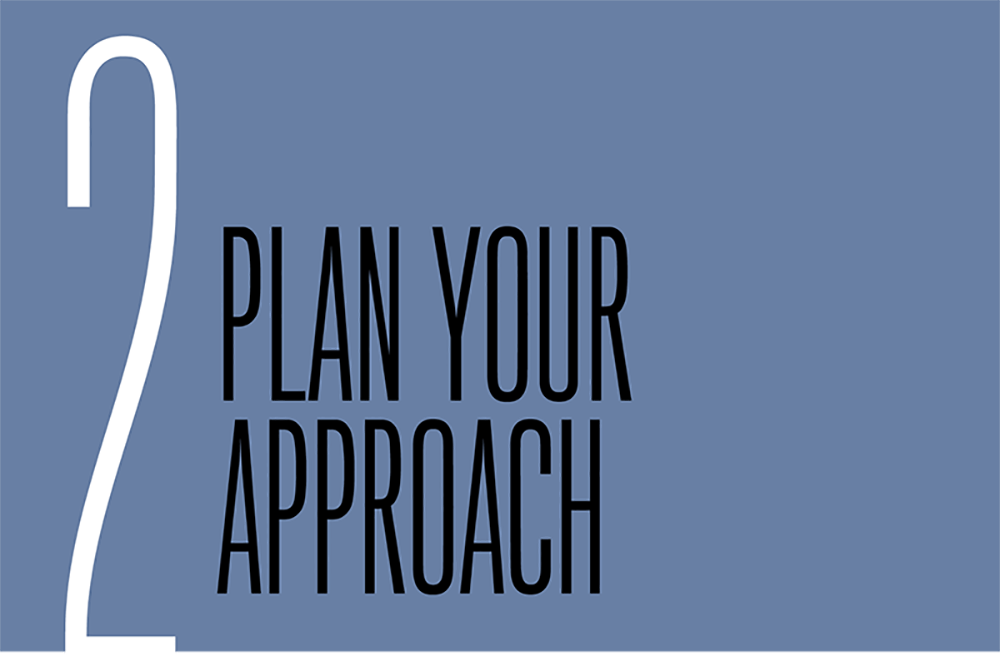

“Stripping everything down to enable a simple and effective smartphone or tablet experience involves a level of strategic planning which many companies have not yet been able to master.”

—ECONSULTANCY (IN ASSOCIATION WITH ADOBE), *“Finding the Path to Mobile Maturity**” (*[http://bkaprt.com/gr/02-01/](http://bkaprt.com/gr/02-01/)*,* *PDF)*

WHAT’S DIFFERENT ABOUT planning a responsive project? In one sense: nothing. Responsive design is just web design, and the principles and processes we’ve developed over the past two decades still apply.

In another sense, responsive projects are completely different—but not because they use fluid grids and media queries. Responsive projects aren’t just about building a website. They’re about training your team. Implementing a new process. Educating the organization on new ways to solve problems. These activities all have value that go beyond making your website work on more devices.

When you’re planning a responsive project, take the efforts required from your entire organization into account. How will you roll out the redesign? What do stakeholders and decision-makers need to do to ensure it goes smoothly? How will you structure your team—now and in the future—so that team members can collaborate effectively?

Any business leader who talks about ROI should understand: it’s not just about the cost of the initiative, it’s about the value returned. Companies that have delivered a successful responsive redesign say they got much more from the initiative than a website that works on smartphones—they got an organization that thinks and works differently. The real value from responsive design comes from the organizational change that happens behind the scenes.

## SCOPING

Responsive design *must* take longer and cost more, right (FIG 2.1)? Ethan Marcotte recounted that after his book *Responsive* *Web Design* was published, naysayers insisted that building websites this way would triple the cost—after all, you’re building a smartphone, tablet, and desktop view ([http://bkaprt.com/gr/02-02/](http://bkaprt.com/gr/02-02/)).

.” He’s probably exaggerating. Probably (http://bkaprt.com/gr/02-03/).")

Organizations that have been through the process report more modest increases in scope. Project leads estimate it takes roughly 25 to 50% more time and budget to implement a responsive redesign. These figures were echoed in a Forrester report:

> Forrester has heard from AD&D \[application development and delivery\] leaders and their agency partners that responsive web design (RWD) takes between 20% to 50% longer (some outliers ranged up to 250% longer) than traditional desktop web design efforts ([http://bkaprt.com/gr/01-25/](http://bkaprt.com/gr/01-25/), PDF, requires purchase).

#### Planning your project

When planning a responsive project, the fundamentals of web design remain the same. The activities and deliverables you typically create for a web project also apply to a responsive project. Once you adapt to some of the process changes required for going responsive, project scope will be consistent with previous efforts. Elliott Jay Stocks, Creative Director of Adobe Typekit, emphasized that responsive projects will not cost more in the long run:

> Once you overcome that initial struggle of adapting to a new process, designing and building responsive sites needn’t take any longer, or cost any more money. The real obstacle is designers and developers being set in their ways ([http://bkaprt.com/gr/02-04/](http://bkaprt.com/gr/02-04/)).

So what are the process changes that result in that initial 25 to 50% increase in scope? The greatest effort (and most unknown risks) arise from the following:

* Training designers, developers, and other team members in new technical skills, like progressive enhancement and designing for performance. (See Chapter 3.)
* Cleaning up and paring down existing desktop content, including reformatting PDFs or Flash videos that won’t work on mobile devices. (See Chapter 4.)
* Educating the entire organization about how decision-making processes change when creating a fluid design that serves all devices, rather than aiming for specific fixed-width layouts. (See Chapter 5.)
* Shifting to a way of working that focuses on building prototypes rather than static deliverables, and coaching the entire organization on being more collaborative and iterative. (See Chapter 5.)
* Testing the website across browsers, device types, and orientations. (See Chapter 6.)

Project managers may tremble at the prospect of an iterative, fluid design process with few set-in-stone checkpoints and few, if any, static deliverables. Brandon Rosage, Creative Director at Ushahidi, said that working this way actually helped them scope the project accurately and reduced the time required for review:

> A big part of scoping our work and offering accurate estimates has been to set down some rules from the beginning—or at least expectations. One of the big changes that has helped is getting out of graphic design applications and into prototypes very, very early. That way there’s less time spent asking people over email, or over Skype, to look at a picture of a design and imagine how it will work. They understand the design by seeing it in action ([http://bkaprt.com/gr/02-05/](http://bkaprt.com/gr/02-05/)).

#### Budgeting beyond responsive

When evaluating the cost of a responsive redesign, keep in mind that these projects cost more because your organization is *doing* more. Along with designing and building a responsive website, many companies are tackling a wider set of problems that get bundled into a redesign. Livia Labate of Marriott remarked, “The responsive program was also a fantastic excuse to fix stuff. That was actually one of the greatest benefits of all” ([http://bkaprt.com/gr/01-53/](http://bkaprt.com/gr/01-53/)).

While the following initiatives are often included as part of a responsive redesign, it’s not quite correct to blame responsive design for the additional cost and time associated with them:

* Creating and enforcing a design system or pattern library. Having these reusable patterns in place will make it easier and faster to build pages, which will reduce costs in the long run. (See Chapter 5 for more information.)
* Replacing existing backend systems, like content management systems or ecommerce systems.
* Implementing new APIs, digital asset management (DAM) systems, or other middleware to support mobile devices.

Even though responsive projects may seem to require more effort, in the years to come, we won’t be comparing the cost of building something responsively against our old fixed-width approaches. Like any new methodology, there will be an initial cost associated with getting everyone up to speed—but over the long term, it won’t cost more or take more time. It will just be the way teams work.

## ROLLING OUT RESPONSIVE

I wish I could tell you there was one true path to rolling out a responsive redesign successfully. But from talking to dozens of organizations, it’s clear that the process by which large organizations go responsive varies widely. Many different approaches will work—but you need to understand the benefits and risks of each approach.

Can you redesign the entire site at once or do you need to stage the rollout over time? Are you going to retrofit the existing desktop site or start from scratch? Will you release a beta version of the site or do a “big reveal”? To find the right option for your organization, ask yourself these questions:

* **How worried are you about existing customers on the desktop** **site?** Now, no one is going to answer, “Not worried even one tiny little bit.” But some organizations (say, publishers) redesign relatively frequently without launching a beta version—they just flip the switch. Other organizations (say, banks) know they can’t risk frustrating existing customers by introducing drastic changes without an adjustment period.
* **Are you redesigning a web application****?** Don’t let anyone tell you that web apps can’t be made responsive. They can—but it takes time and effort. If you have large tabular presentations of data, complex form-based transaction flows, or tricky integrations with legacy backend systems, be sure to build additional time into your process.
* **Do you plan to make changes to your** **content?** A responsive redesign is a fantastic opportunity to clean up and pare down your existing content—you may never get a better chance to fix bloated content that isn’t doing its job. That said, many organizations find they can’t do everything at once, so they roll out the content cleanup in stages.
* **Do you plan to implement** **a new CMS or APIs?** Many organizations report that the work they’ve done over the past few years to replatform their publishing systems makes going responsive much simpler. But you’ll need to decide whether to do the CMS or the redesign first. It’s riskier and more time-consuming to do them at the same time.
* **Are** **your stakeholders prepared for the review process?** Some organizations use a responsive redesign to engage the entire organization in learning a new process. Others take a “better to ask forgiveness than permission” approach, rolling out the redesign first and fixing the inevitable broken pieces later.

Once you know the answers to these questions, consider your options for going responsive.

### Retrofit

Doing a responsive retrofit means recoding the front end of the website with little or no change to the existing content and design.

I must confess: before I started talking to companies that launched a successful responsive retrofit, I was convinced this was the worst of all possible options, doomed to deliver a subpar experience to everyone involved. My philosophical beliefs about the “right way” to manage web processes don’t always survive their encounters with the real world: I concede that a retrofit works well in some scenarios.

In general, retrofits work best when at least one of the following statements is true:

1. The content isn’t going to change (much).
2. Complex web applications don’t need to be redesigned.
3. A componentized framework is already in place.

Companies like Capital One, Marriott, and Nationwide Insurance have implemented responsive retrofits successfully. Doing a retrofit forced them to focus on the responsive aspects of the project without getting sidetracked by larger questions of redesigning the site, editing the content, or replatforming the CMS. For many websites, a retrofit also helps mitigate political concerns around changing or damaging the desktop experience, since it doesn’t change much.

Here’s how you roll out a retrofit right:

* **“Don’t touch the desktop”** is a mandate often handed down to the responsive team, but this guideline is too limiting. It forces the team to work toward unnecessary design parity at the expense of making better design decisions for smaller screens.
* **“Do no** **harm to the desktop”** is a more realistic and achievable ambition. This gives teams the flexibility they need to make adjustments to layout, design, navigation, or content.
* **Set realistic expectations** with your team and develop a plan for making changes over the long term. Stakeholders may be surprised when they see how existing content and functionality shifts around on different screens.
* **Consider picking one section** for a complete responsive overhaul. A fully edited and redesigned section can provide a useful point of comparison with the retrofit. Picking a section for a complete redesign will give teams experience with the process, show stakeholders what’s possible, provide insight into the level of effort that can inform future scoping processes, and offer real-world data about how a fully redesigned experience will perform compared to the retrofit.

### Beta release

In recent years, popular web applications like Gmail, Flickr, and Delicious launched in beta—and stayed in beta ([http://bkaprt.com/gr/02-06/](http://bkaprt.com/gr/02-06/)). This “perpetual beta” approach was a precursor to the continuous deployment practices used by many applications today to support ongoing development and testing.

Today, when teams say they’re launching in beta they often mean that users can opt out of the new site at any time and return to the “classic” version of the website. This “parallel beta” approach requires significantly more time and effort to develop and review, but in return delivers the ability to roll out the redesign slowly, gathering user feedback and analytics data along the way.

Companies like Fidelity, Beatport, and the *Guardian* have invested in parallel beta releases, which gave them a way to test and learn from the responsive design over time. Stephen Turbek of Fidelity said their decision to launch in beta was crucial to their success:

> One of our first steps was to build a beta site that people could opt-in to, try out for a while, and return to the current site. The beta site was significant additional work, but iterating live on a site with millions of passionate customers would not have been the right approach. This enabled us to make changes faster and get lots and lots of user feedback ([http://bkaprt.com/gr/01-16/](http://bkaprt.com/gr/01-16/)).

Here’s what needs to happen to launch a successful beta:

* **A** **test-and-learn culture** should already be established in your organization. Teams must be comfortable working in tight cycles of iteration and testing—most teams will need to run tests every six weeks, and even as frequently as every week or two. If you don't already work this way, building a culture of learning from research will take time and add complexity.
* **Technical architecture** and publishing infrastructure must be in place so users that can opt in and out, which can be costly.
* **Executive buy-in** from stakeholders who see the value of the beta process and are willing to invest in maintaining two versions of the site—not to mention driving traffic to two different URLs—is crucial.
* **Quality assurance testing** (QA) becomes exponentially more complex when testing on more form factors. Don’t underestimate the time or staff you’ll need to QA two versions of the site.
* **Rolling out the beta in stages** will help control who can access it. Alex Breuer, Creative Director at the *Guardian*, said they found that showing the beta site to users coming in through search or social “was a gentle way of introducing the new Guardian experience” ([http://bkaprt.com/gr/02-07/](http://bkaprt.com/gr/02-07/)).
* **Assume early feedback will be negative** if your beta site excludes content or functionality from the old site. Help stakeholders understand that negative feedback is not a sign of failure—in fact, getting these comments early is the whole point of the beta.

### Mobile-only responsive

Another rollout strategy—often but not always implemented in the context of a beta release—is to develop a responsive website that covers all sizes of smartphones and tablets, preserving the current fixed-width site for desktop users only. In a sense, this approach is a “responsive m-dot site,” but that word puzzle twists my brain into a knot, so let’s not call it that. We’ll call it a *mobile-only responsive* *site*.

A mobile-only responsive site buys an organization time to focus on larger, more complex issues. Companies know they need a site that serves mobile users, but they’re afraid to hurt existing desktop traffic. But they also know the site needs a complete redesign or major backend infrastructure improvements, so they don’t want to do a retrofit. In that sense, a mobile-only responsive design offers the best of both worlds. Teams can focus on getting the responsive design right, without dealing with the stakeholder politics and operational risks inherent in changing the desktop mothership.

But this approach is also the worst of both worlds—it allows stakeholders to keep believing that the desktop website is the “real” website, downplaying the large and growing population of mobile users. It also means, as with all m-dot sites, that smartphone and desktop users will suffer from the same performance hit due to server redirects.

Here’s what can you do to launch a successful mobile-only responsive site:

* **Treat it like a beta** even if you’re not rolling it out in stages. Have a plan for gathering data, testing, and revising the responsive site. Over time, plan for a staged rollout to desktop users.
* **Make tough choices** about content and functionality. This rollout strategy is most successful when it is used to clean up and pare down a site that’s gotten out of control. If you’re not prepared to make the hard decisions, just do a retrofit.
* **Educate your team** on what makes a responsive website successful. The risk with a skunkworks approach is that the “mobile” team will go off and do its own thing and the rest of the organization won’t learn from the experience.
* **Make it** **the** *real* **website.** Set expectations that this process isn’t about building a “mobile” website—it’s about building a site that will eventually replace the desktop.
* **Know when** **to stop investing in the desktop site** and shift resources to the responsive site. BBC News said that continuing to work on their desktop site “sucked resources and morale and that cost us dearly by delaying our strategic move to ‘Responsive News’” ([http://bkaprt.com/gr/02-08/](http://bkaprt.com/gr/02-08/)).

### Section by section

Other organizations choose to start with a specific section—even one particular page or template type. Rather than doing the entire site at once, they choose to sandbox their efforts and give teams time to practice.

Which section should you start with? The answer to that question varies as widely as any other rollout approach. Some organizations report that they picked a section they knew they wanted to redesign. Celebrity Cruises started with their Destinations section, making it responsive as part of a larger effort to rewrite content and replatform the CMS ([http://bkaprt.com/gr/01-21/](http://bkaprt.com/gr/01-21/)). Other companies start with a less-popular section, a section run by stakeholders who are excited about the process, or one that gets a disproportionate amount of mobile traffic.

And then there’s Microsoft, which started with their homepage. This Potemkin village approach to a responsive redesign can frustrate users—promising them a website that works well on mobile devices, only to betray those expectations on the first tap. But Chris Balt from Microsoft reported that it helped them get organizational buy-in on going responsive:

> Other sites have taken different approaches, starting from the bottom up or with some out-of-the-way corner of the site. Our attempt to do it first with the homepage—and beautifully so, if I say so myself—was a good choice. It led to significant visibility that I don’t think we would have gotten if we had started with some second-level support site or something like that. So even though the experience for a user may have suffered—they are one click away from a non-responsive experience—the visibility that it obtained us politically, organizationally, both inside and outside the company, made it a great choice. I am very glad that we did it that way ([http://bkaprt.com/gr/01-14/](http://bkaprt.com/gr/01-14/)).

Here’s how you might go about rolling out a responsive redesign by section:

* **Choose a section** that reflects the types of problems or design patterns you’ll find elsewhere on the site. Some sections, like “Investor Relations” or “About Us,” may be easier to implement because they have relatively simple content and layouts—but they won’t provide as much insight about how to handle more complex problems.
* **Focus on your core.** As with Pilates, your core does all the work. Look at your traffic and usage data to identify the pages and sections of the site that matter the most to users. Put your energy there.
* **Make sure your first-round stakeholders are on board** with the extra effort required to support the redesign. They’ll be asked to make unfamiliar decisions—and they’ll need to share and defend their rationale with the rest of the organization.
* **Track and document scope** to inform future initiatives. Knowing how long certain processes take, where design and development teams ran into difficulty, and which decisions were challenging for stakeholders will help you plan the next phase of work.
* **Make global decisions with everyone in mind.** Some choices really do affect everyone. Dealing with responsive images, designing navigation menus, identifying core content types, developing reusable modules as part of a design system—such topics require buy-in from more than just the people managing a particular page or section.

## ORGANIZATIONAL CHANGE

You’ve made a plan for rolling out your responsive redesign, taking into account how your organization makes decisions. You’ve gotten buy-in on the budget and timeline, even though it may cost a little more than everyone hoped. You’ve communicated to stakeholders how their involvement may change, and you’ve done your best to prepare them for what might go wrong.

Have you planned to restructure your teams, change reporting relationships, or hire for new roles? Because you may need to do that, too.

Trei Brundrett, Chief Product Officer at Vox Media, said, “A responsive design approach really wasn’t a design approach, it was an organizational approach to thinking and aligning everything else about how we worked and how we built things together.” The process of going responsive forced Vox to go deeper into what it meant to have a collaborative culture ([http://bkaprt.com/gr/02-09/](http://bkaprt.com/gr/02-09/)).

### Integrate your mobile team

When smartphones were new to the world, many companies set up a “mobile” team to research and evangelize this new platform. Members of these teams were encouraged—even incentivized—to develop solutions separate from the lumbering 500-pound gorilla that is the desktop website. Freed from the strictures of negotiating with dozens of stakeholders, teams were able to build native apps or m-dot sites quickly.

But what worked when mobile was a blip on the radar no longer works when mobile is 50% of your traffic. Teams now must be encouraged—and incentivized—to build products that work across all devices. A separate mobile team doesn’t help you get there, as Bill Scott from PayPal found:

> The way the company was organized really contributed to this problem. Mobile was a separate organization; thinking about and talking about mobile was another team’s responsibility. So teams really didn’t think about how to make experiences that just naturally span across platforms. The world was sharply divided between native and web, and web was just thought of as desktop ([http://bkaprt.com/gr/01-52/](http://bkaprt.com/gr/01-52/)).

Remember that people whose jobs are defined by treating mobile as a distinct platform will have good reason to argue against responsive design. Many organizations privately report they had a tricky political situation to navigate, where responsive, app, and m-dot approaches stood as proxies for the professional future of leaders within the team. Mobile is yet another instance where the user experience should not mirror your organizational structure.

### Integrate your designers and developers

Of all the planning involved in setting up a responsive redesign, perhaps none comes as a bigger surprise than the need to reorganize the design and development teams. Collaboration and iteration—always a good idea—are at the very heart of a successful responsive redesign. Processes built on prototyping require teams to work closely together. Designs can’t simply be documented in comps or specs and then “thrown over the wall” to developers.

While it’s tempting to think this problem can be solved on a short-term case-by-case basis—maybe by moving one developer’s desk for a couple of months—the long-term success of responsive projects requires that your design and development teams all pull in the same direction. Tom Maslen, Tech Lead at the BBC, explained, “If you want to make better products, if you want faster development cycles, then embed UX into the development teams and make us jointly responsible for the same objective: a working website” ([http://bkaprt.com/gr/02-10/](http://bkaprt.com/gr/02-10/)). When designers and developers sit on different teams and report to different people, they’re motivated by different goals and expectations. Aligning everyone may need to happen at higher levels of the org chart.

Even if design and development teams remain as separate groups, managers must train teams and facilitate a much higher degree of collaboration. Jason Chandler, Manager, Client Side Engineering at Expedia, explained that the need for his developers to work closely with the design team affected his hiring, training, and communication processes:

> Some aspects of responsive design are quite complex. What we don’t want is a hit-and-a-miss where no one can speak the same language, because that kills productivity. In order for this to work, it required really close integration between engineering and UX ([http://bkaprt.com/gr/01-20/](http://bkaprt.com/gr/01-20/)).

You may also need to envision new roles with new skills. Fidelity created and started hiring for a new position called “UX developers.” Nationwide created a new role called “creative technologist.” Jason Grigsby of Cloud Four said they are hiring for a position they just created, titled “front-end designer.” These new roles help bridge design and development processes. We’re building working prototypes now rather than creating documents, comps, and other static deliverables.

### Train your technical team

Your core team—the designers and developers tasked with actually building the responsive design—need training on how to do it right. Even experienced development teams require time to get up to speed on new responsive design techniques. The basics of fluid grids, flexible images, and media queries are relatively straightforward—but it takes real-world experience to know how to deal with complex content challenges, manage testing across devices, and ensure fast performance on every platform.

Think about how you will train and educate your technical team:

* **What** **training do you plan to offer?** Conference or workshop sessions will deliver more value if multiple members of the team participate. Do you have a budget for books, webinars, or training videos? Plan to discuss or watch them together.
* **Do you plan to work with an outside agency to** **complete this work?** If so, build time for training your in-house staff into the scope of work—otherwise the agency team will walk out the door with all the experience.
* **Do you plan to task a small, centralized team** **with implementing the responsive design?** If that team will later be responsible for coaching other product teams on responsive rollouts, build time into the process for knowledge-sharing along the way. Expedia completed a responsive redesign of their cars section (a smaller, simpler line of business) in parallel with their hotels section (their bread and butter). The team that led these processes gained valuable insight that later benefited teams working on flights and vacation packages ([http://bkaprt.com/gr/01-20/](http://bkaprt.com/gr/01-20/)).
* **Do you need the entire organization to understand how** **responsive design changes the process?** (Yes, you do.) Responsive design will change the way you work and communicate, moving away from static comps and formal documentation. Project managers, backend developers, and QA testers need to work differently—even if they are not considered part of the “responsive redesign.” Marriott implemented a distributed model that was designed to give *everyone* experience in designing and building responsive sites. Rather than tasking one centralized team to do the work, each individual group and business unit was responsible for making their own pages responsive. It took longer and was more complicated, but it was an approach to training that delivered the organizational transformation they needed ([http://bkaprt.com/gr/01-53/](http://bkaprt.com/gr/01-53/)).

Training is important, but there is no substitute for doing the work. Depending on how your company handles scoping and budgeting, you may want to break training costs out of the budget. Learning how to work in a new way is the real challenge.

## LEVELING UP

What if I told you that a responsive redesign would, in the end, deliver more than a website that works on smartphones and tablets? As should be abundantly clear by now, responsive design is a learning experience as much as a concrete outcome.

Livia Labate from Marriott, in a personal conversation, described their responsive program as three initiatives in one:

1. **Create the responsive site**, so the website works across multiple devices.
2. **Train teams on new technical skills**, whether those are specific to responsive design, like media queries or responsive images, or more general, like prototyping.
3. **Adopt a** **new process** and a new set of values for the organization, like working in a more collaborative, iterative way.

Teams report that going responsive makes them more collaborative, and the benefits of that last beyond this one initiative. Frank Punzo, Interactive Design Manager at Children’s Hospital of Philadelphia, said their redesign forced the design and content teams to work closely: “It’s really benefited the team because it shows the way we all think and work together, and it’s just made us more of a cohesive unit” ([http://bkaprt.com/gr/02-11/](http://bkaprt.com/gr/02-11/)).

This new reality gives teams a chance to be more strategic about how they approach the website, engaging designers and developers in conversations about the broader business value of their work. Robert Huddleston, Senior Creative Director of UX/UI at Capital One, said the success of their responsive design helped to shift company perception of their team and reinforce their value:

> We saw such a huge amount of business benefit from this responsive effort that it brought the design team to a place where we now have a seat at the table when we talk about business strategy. We deliver business value. We’re not just a production team where we’re cranking out web pages. We are influencers now when it comes to brand strategy and business strategy based on this one effort. It’s really done a lot for our team internally ([http://bkaprt.com/gr/01-39/](http://bkaprt.com/gr/01-39/)).

Organizations gain value from responsive projects that goes well beyond a new website. One of the biggest benefits comes from a place you might not expect—a focus on performance. Let’s look at how these changes in process and culture can help speed up your site.
