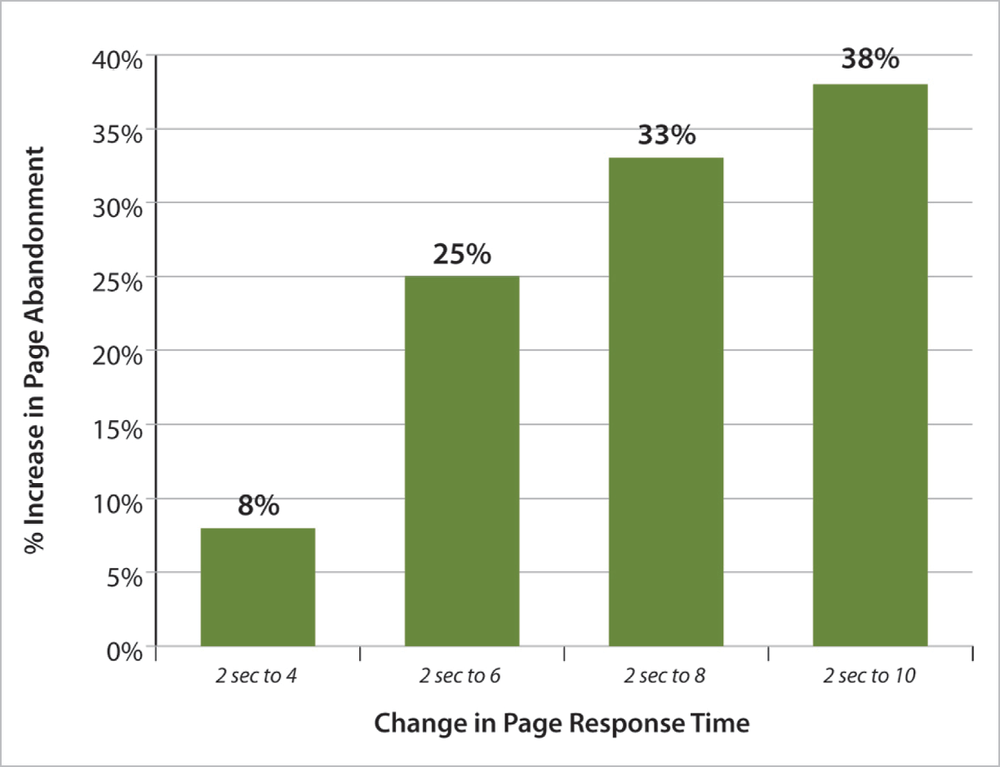
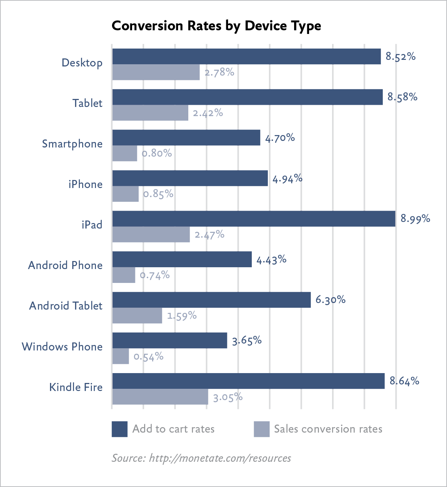
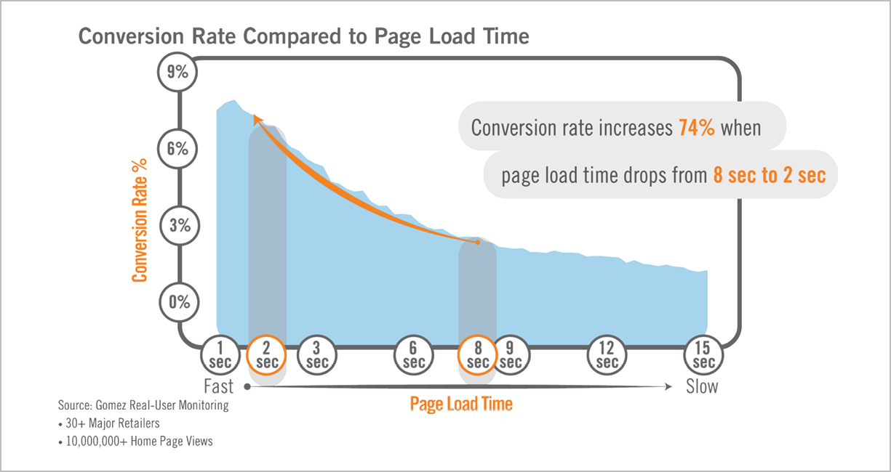
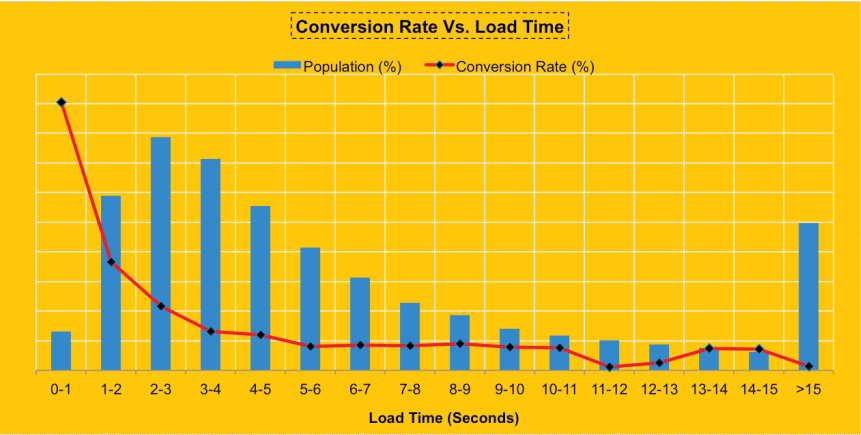
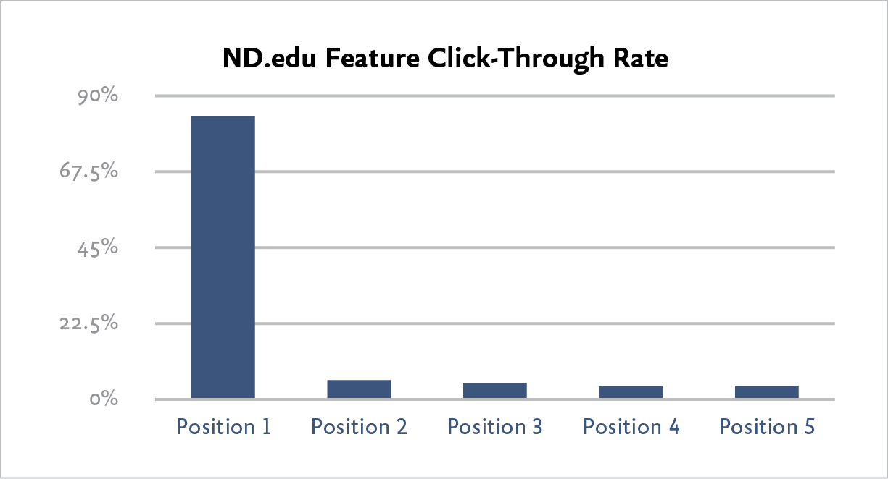
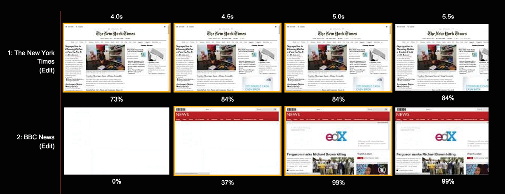

“The company wasn’t merely doing a redesign, they were also starting down the path to a better culture of performance inside their organization.”

—TIM KADLEC, *“‘RWD Is Bad for* *Performance’ Is Good for Performance” (*[http://bkaprt.com/gr/03-01/](http://bkaprt.com/gr/03-01/)*)*

A FRIEND WHO READ a very early draft of this book said, “The order of the sections seems off. It should follow a typical design process, with performance coming later.”

That’s precisely the problem we’re trying to solve.

After all the design decisions have been made and all the pages built, we discover that the website is too damn slow. Performance optimization is done in retrospect as a belated attempt to fix what’s already broken. When you’re going responsive, that doesn’t work anymore.

Have you ever ignored your winter weight gain—reasoning that you still fit into your comfy pants—but then realized it was time to go on a diet once swimsuit season rolled around? Trying to fit a bloated desktop website into a slim-fitting mobile screen is a bit like that. Slower connection speeds and pay-by-the-megabyte downloads on mobile mean that, now, people are finally paying attention to performance problems.

Getting your company to care about performance may be one of the best outcomes of implementing a responsive design. When you make decisions about what to include on the website through the lens of performance, you’re forced to make tough decisions about what *really* provides value to the user. And that results in a better experience for everyone.

## A BRIEF PERFORMANCE PRIMER

How fast any given web page loads depends on many factors: the weight of code and content, the number of server calls, the relative speed of the network, and the capabilities of the browser and the device—just to name a few. Because performance is so technical, conversations about how to improve it are typically left to engineers. This needs to change. Designers, marketers, and stakeholders must understand how their decisions will affect the speed of the website, and how tradeoffs will be negotiated.

Although performance optimization is complicated, most team members only need to understand the basics, which I’ll cover here. (For a closer look, pick up a copy of *Designing for Performance* by Lara Hogan and *Responsible Responsive Design* by Scott Jehl.)

### Page weight

Statistics from the HTTP Archive Report, analyzing traffic from 300,000 websites, show that the average web page in 2014 weighed around 2 MB (1.953 MB, to be precise), which reflects an increase of 15% from 2013 ([http://bkaprt.com/gr/03-02/](http://bkaprt.com/gr/03-02/)). The size of the average web page has increased 186% since 2010 ([http://bkaprt.com/gr/03-03/](http://bkaprt.com/gr/03-03/)). As Jason Grigsby said, “We’ve remade the Internet in our own image, which, in the United States, is obese” ([http://bkaprt.com/gr/03-04/](http://bkaprt.com/gr/03-04/)).

Images make up the largest percentage of page weight—more than 50% on average. Web fonts are another growing factor, shown in “other.” Developers can optimize file size, especially for CSS and HTML, but doing so doesn’t deliver enough performance gains to offset other increases (FIG 3.1).

.")

### Server calls

Every element on a web page—HTML, CSS, images, fonts—requires the browser to make a request from the web server. Sometimes those requests get redirected to a different server, like when the user gets sent over to a different domain or an object is downloaded from a third-party server. All of these requests and redirects take time to receive and process.

While we can reduce the number of elements on the page and bundle multiple files so they can be downloaded in one server call, much of the delay is based on how far away the user is from the server itself. This delay varies widely and may add anywhere from 100 milliseconds for a fast wired connection to a full two seconds (or more) over mobile networks.

Stakeholders don’t need to worry too much about the nuts and bolts of server calls, except to be aware that it isn’t entirely an engineering problem. Redirects and third-party server calls have a real effect on performance and your entire team should take this into account when making decisions.

### Download speed

So, how fast does the page load? While that seems like the metric we should focus on, many factors influence how quickly a page loads for any given user—including device type and network speed—and not all of them are within our control. Experts in web performance frame goals for download speed under specific network conditions (like 3G or broadband) and evaluate performance at certain percentiles (like the best, average, and worst download times—or first, fiftieth, and ninety-ninth percentiles).

### Perceived performance

“Time to interact” is a metric that evaluates the perceived performance of the site—how quickly the page appears to load. How fast a user *thinks* the site loads is more important than how fast it really loads. Developers use a variety of techniques to influence users’ perception of response time—like setting active states for buttons, using momentum scrolling, and choosing to display spinners and progress bars (or avoiding them).

But the biggest effect on perceived performance doesn’t come from these little interface tricks. A study by User Interface Engineering found that Amazon, the slowest site in the study, was perceived to be one of the fastest, while About.com, despite being the fastest to download, was rated slowest by users. What caused these paradoxical results? It turns out there is a strong correlation between perceived performance and being able to complete tasks ([http://bkaprt.com/gr/03-06/](http://bkaprt.com/gr/03-06/)).

Good coding practices can make sites feel faster by loading the most important information first. Users can start reading or interacting with the site immediately while the rest of the page continues to load. Of course, that means you’ll need to understand the priority of each element on the page. Better performance requires more than attention from developers—it needs insight from UX designers, marketers, and content strategists, too.

## WHY PERFORMANCE MATTERS

Your design decisions doom your users to staring at their phones, waiting impatiently for your site to load—or send them into the alluring embrace of your competitors. Instead of waiting until the site is built and launched to figure this out, get your whole team focused on performance from the start.

Nobody cares about speed for its own sake—they care about the value a faster website provides to the business and the user. So start talking about why making decisions through the lens of performance will change the way you design. A culture of performance means framing design decisions and content choices as tradeoffs that ultimately affect the user experience and the bottom line.

### Interactivity

Delays in response time have a cognitive cost. Does the user’s attention wander? Does she feel in control? That hinges on how quickly the device appears to respond.

Performance requirements are based on fundamental aspects of human cognition and perception—they don’t change with the technology. Eye tracking research on web users today shows the same findings as human factors research on mainframe users from forty years ago: users notice and are affected by sluggish response times, even those under one second ([http://bkaprt.com/gr/03-07/](http://bkaprt.com/gr/03-07/)).

Jakob Nielsen, called “The Guru of Web Page Usability” by the *New York Times*, has been writing about web performance and response times since 1993. His findings—consistent over the past twenty years—show that even the tiniest delays change how users interact with websites ([http://bkaprt.com/gr/03-08/](http://bkaprt.com/gr/03-08/)):

* **100 milliseconds.** For a web application that requires instantaneous feedback—say, when objects are selected or dragged—response times must be under 100 milliseconds. (Yes, that’s one-tenth of a second!) Longer waits mean that the experience feels sluggish.
* **1 second.** For a website that the user expects to read and navigate, response times should be under one second. Longer waits mean that users lose their sense of “flow” and feel like they’re waiting for the device to respond. With a delay of a second or two, users must really want to use the website—otherwise, they lose focus.
* **10 seconds.** For all interactions, response times must be under ten seconds. Longer waits mean that users will switch to another task, and need to reorient themselves when they return—which is a productivity-killer. A delay of ten seconds means users are likely to give up on the website.

What happens after even a short delay? Users abandon the site outright, or they muddle onward, but conversion rates are low.

### Abandonment

When a page loads slowly, many users leave and don’t come back. “Bounce rate” is one of the most important metrics we can use to analyze web and mobile performance (FIG 3.2).

By reviewing abandonment data across more than 150 websites and 150 million page views, Gomez, cited by eConsultancy, found that an increase in response time from two to ten seconds increased abandonment rates by 38% ([http://bkaprt.com/gr/03-09/](http://bkaprt.com/gr/03-09/)).

Similarly, research from Aberdeen found that 25% of users will abandon a web application after just three seconds of delay ([http://bkaprt.com/gr/03-10/](http://bkaprt.com/gr/03-10/), PDF, requires registration).

Etsy found that adding 160 KB of images to a page increased bounce rate by 12% on mobile devices, according to Lara Hogan, author of *Designing for Performance* ([http://bkaprt.com/gr/03-11/](http://bkaprt.com/gr/03-11/)).

### SEO

Google has used site speed in its ranking algorithm since 2010 ([http://bkaprt.com/gr/03-12/](http://bkaprt.com/gr/03-12/)). Although speed is not as important as page relevance, it does matter. Google penalizes common mobile configuration problems that affect site performance, like faulty redirects ([http://bkaprt.com/gr/03-13/](http://bkaprt.com/gr/03-13/)). Google seems to be experimenting with a “slow” label for websites, a sort of Scarlet Letter for sites that don’t perform well ([http://bkaprt.com/gr/03-13/](http://bkaprt.com/gr/03-13/)). Whatever happens with this experiment, it’s clear that Google takes performance seriously and will rank sites lower if they’re too slow.

### Conversion rate

Conversion rates on smartphones are already quite low. Customers are more likely to use their phones for research, then purchase in another channel—on their desktop, or potentially in-store. Research from Monetate, cited by Smart Insights, found that conversion rates on smartphones are generally under 1% (FIG 3.3). Conversion rates on tablet devices are similar to desktop computers ([http://bkaprt.com/gr/03-15/](http://bkaprt.com/gr/03-15/)).

Increasing conversions requires attention to many different factors, but one clear-cut way to improve conversion rates is improving site speed (FIG 3.4). Research by Gomez, cited by Compuware, of more than thirty major retailers found that conversion rates increased 74% when page-load time dropped from eight seconds to two seconds ([http://bkaprt.com/gr/03-16/](http://bkaprt.com/gr/03-16/), PDF).

Similar conversion rate gains have been found by many other firms that have invested in improving web performance—while increasing revenue for retailers is the most obvious scenario, firms that measure conversion by downloads or donations also have seen a boost. Paying attention to performance directly translates into increased business value.

* **Walmart.** By acknowledging that they weren’t the fastest retailer on the web, Walmart was able to focus on improving load times (FIG 3.5). For every second of improvement, they experienced up to a 2% increase in conversions; for every 100 milliseconds of improvement, they grew incremental revenue by up to 1% ([http://bkaprt.com/gr/03-17/](http://bkaprt.com/gr/03-17/)).
* **GQ.** The magazine reduced page load time 80% (down to two seconds), and saw an 80% increase in monthly unique visitors, from 6 million to 11 million. Median time spent on site increased from 5.9 minutes to 7.8 minutes ([http://bkaprt.com/gr/03-18/](http://bkaprt.com/gr/03-18/).
* **Google and** **Bing.** The two leading search engines A/B tested performance and found that a 500-millisecond delay caused a 20% drop in traffic ([http://bkaprt.com/gr/03-19/](http://bkaprt.com/gr/03-19/)).
* **Staples.** By reducing the median homepage download time by one second (and a whopping six seconds for visitors in the ninety-eighth percentile), Staples increased their conversion rate by 10% ([http://bkaprt.com/gr/03-20/](http://bkaprt.com/gr/03-20/)).
* **Firefox.** By taking 2.2 seconds off the average page load time, Firefox increased download conversions by 15.4% ([http://bkaprt.com/gr/03-21/](http://bkaprt.com/gr/03-21/)).
* **Shopzilla.** The retailer reduced page load time by five seconds and increased site conversion rates between 7 to 12% ([http://bkaprt.com/gr/03-22/](http://bkaprt.com/gr/03-22/)).
* **Obama for America.** The 2012 campaign website improved page load time from five seconds to two seconds. After conducting 240 A/B tests, the new site improved donation conversions by 14%, an increase of over $34 million ([http://bkaprt.com/gr/03-23/](http://bkaprt.com/gr/03-23/)).

## RESPONSIVE AND PERFORMANCE

Responsive design has developed a reputation for being “bad for performance.” Even advocates for responsive design conclude that it incurs performance tradeoffs that could be avoided by maintaining separate desktop and m-dot websites. Guy Podjarny, formerly CTO, Web and Mobile at Akamai, wrote, “I think you have to face the music—RWD makes it very hard to write a fast website” ([http://bkaprt.com/gr/03-24/](http://bkaprt.com/gr/03-24/)). He went on to say that even though he would recommend responsive design to most organizations, it “puts some real roadblocks in the way of a website trying to be fast.”

Let’s look at two things that slow down responsive websites.

### Complex front-end code

The HTML and CSS for responsive sites is, by definition, more complex than standalone desktop or mobile sites. Apples to apples, even the most carefully built responsive website will be slightly larger and require more processing—and that’s the best-case scenario. In an ideal world, everyone would be experts in planning and building sites using progressive enhancement, so each device would only download the code that it needs. In the real world, responsive designs are sometimes flawed, built by inexperienced developers working under tight deadlines—so users wind up downloading CSS or scripts they don’t need.

But HTML, CSS, and scripts make up a small fraction of the total page weight. The real problem occurs when imperfectly implemented responsive design forces less-capable devices to download *content* that doesn’t get shown to the user.

### Overdownloading content

Guy Podjarny conducted studies of responsive web design performance in 2012 and 2013. The second study found that 72% of responsive websites download the full content of the website at every resolution, while only 6% of sites are significantly lighter at smaller screen sizes ([http://bkaprt.com/gr/03-25/](http://bkaprt.com/gr/03-25/)).

The primary causes of overdownloading are techniques used to maintain the experience for desktop users at the expense of mobile users:

* **Download and hide.** The simplest way to preserve the desktop experience without overwhelming mobile users is to hide content on smaller screens. Sidebars, large images, or anything built in Flash gets set to `display:none` at smaller breakpoints. Mobile devices still load all of the content (possibly over slower, pay-by-the-megabyte cellular networks), but it doesn’t get shown to the user. The user pays the price in slower speeds and receives no benefit from downloading all that content.
* **Download** **and shrink.** Large images or other media types are downloaded and then scaled for smaller devices, which means the less-capable devices pay the penalty for all that high-bandwidth media.

Some of the problems with overdownloading can be solved by improving the quality of responsive design implementations—something that will emerge as developers get more practice. Tim Kadlec, author of *Implementing Responsive Design* says, “Blame the implementation, not the technique” ([http://bkaprt.com/gr/03-26/](http://bkaprt.com/gr/03-26/)). Rather than downloading and shrinking large images, optimize your image files or implement responsive images. Rather than downloading and hiding content, make sure less capable devices only download what they need.

## PERFORMANCE IS A CONTENT STRATEGY PROBLEM

Your developers are likely doing everything in their power to fix your performance problems. They’re refactoring CSS and JavaScript, combining files to reduce the number of server calls, compressing or caching files and images—even removing unnecessary spaces in code, a process called “minification.”

What are *you* doing?

The biggest culprits behind bloated, heavy pages aren’t necessarily under your developers’ control. Performance suffers because stakeholders insist they must have everything but the kitchen sink on the website. Full-bleed images, giant carousels, web fonts, social widgets—each of these comes at a cost, and the user pays for it in download speed.

### Unnecessary content

Too often, companies focus on making small performance improvements when the real benefits would come from making difficult decisions about what needs to be on the website. It’s a bit like going to the Container Store to buy yet another plastic organizer, when what you need to do is to throw things away.

One of the most common concerns I hear from companies about going responsive is this: “But won’t the desktop look empty?” Your homepage weighs 7MB. Your right column is a junk drawer. Your nav goes five levels deep. Your problem is not that your website will be too spartan (FIG 3.6).

Be honest: are you keeping everything on your website because you know it’s providing value? Or because you don’t want to have all the conversations you know you’d need to have with stakeholders to remove it? It’s not okay to hide content from mobile users or develop an m-dot site that offers a subset of what’s on the “real” website. But it is okay—necessary, even—to clean up the clutter. In Chapter 4, we’ll cover how to evaluate content quality, but first let’s look at some of the types of content that slow down websites.

### Large images

While images are a major contributor to page weight even on desktop sites, they’re a particular problem for responsive sites, because different device sizes and screen resolutions may require different image sizes or entirely different image crops. Tim Kadlec wrote, “The most common offender for poor responsive performance is downloading unnecessarily large images, or worse yet, multiple sizes of the same image” ([http://bkaprt.com/gr/03-27/](http://bkaprt.com/gr/03-27/)). (For more about responsive images, check out the Resources in the back of the book.)

While developers have all sorts of techniques to optimize images, the first line of defense should be to ask yourself: do we need this image at all? Images are often merely decorative, advocated by designers or marketers who like the layout but haven’t considered the performance tradeoffs.

Mobile is a great test of whether stakeholders *really* need those giant images. If your team thinks it’s okay to remove an image from the smartphone view, then maybe no one really needs it at all.

### Carousels

So, you’ve got some large images, and you wonder, “How can I pack the biggest performance hit into the smallest amount of space?” A carousel may be for you.

Marketers and stakeholders *love* carousels. Rather than make tough decisions about how to allocate precious real estate, people shove everything into a rotator and call it a day. Trouble is, that doesn’t actually solve the problem—users don’t click through the images in the carousel, but downloading all those files can drag down performance (FIG 3.7). Erik Runyon, Technical Director at Notre Dame University, reported data from several websites showing few users interact with carousels beyond the first position in the rotator ([http://bkaprt.com/gr/03-28/](http://bkaprt.com/gr/03-28/)).

Alas, it’s likely that carousels will be an even more popular design pattern on mobile devices, because screen real estate is even more constrained. *Stop it*. Think of it this way: users must swipe to get to the content—swiping horizontally in a carousel or vertically on the page. But users are *less* likely to see and interact with the items in a carousel! A carousel adds unnecessary code and page weight to achieve this flawed objective.

### Web fonts

Remember the days when every single website used a combination of Arial and Georgia? A small number of fonts were available on every platform, and using them guaranteed that web pages looked the way designers intended.

In our fragmented mobile device landscape, we can’t assume every user will have the same system fonts anymore. In his research to create a compatibility table of default fonts across major operating systems, Jordan Moore, Web Designer and Front-end Developer at Eyekiller, was forced to conclude: “There is no safe native typographic foundation on today’s web” ([http://bkaprt.com/gr/03-29/](http://bkaprt.com/gr/03-29/)).

Fortunately, today we have web fonts. Web fonts help maintain brand consistency across platforms—but they also require the user to download more files, and that affects performance. Poorly implemented web fonts also hurt perceived performance, blocking screen rendering while they load or displaying a flash of unstyled text. While there are plenty of tricks developers can use to manage the way fonts get loaded, marketers and designers should do their part, too, by making decisions about which fonts are absolutely, positively required. Ask yourself:

* **Do we need all** **these fonts?** Ransom-note typography has been popular since the desktop publishing era, but just because you can doesn’t mean you should.
* **Do we need every weight and** **character set for this font?** Font families are broken down by weight and style. If the bold italic version of the font isn’t needed, for example, protect your site performance by not including it.
* **Could we choose a different** **typeface?** Because fonts must be loaded on every page, the file size for the font itself really matters. Katie Kovalcin, Designer at Sparkbox, suggests choosing an alternative typeface with a similar style and smaller file size ([http://bkaprt.com/gr/03-30/](http://bkaprt.com/gr/03-30/)).
* **Do smaller screens need to look exactly like** **larger screens?** It’s possible to compromise by sending custom fonts only to larger screens—but everyone needs to agree on making that tradeoff ([http://bkaprt.com/gr/03-31/](http://bkaprt.com/gr/03-31/)).
* **Could we replace** **icon fonts with SVG?** Many sites have tried to improve performance by replacing images with icon fonts. But icon fonts pose an accessibility problem for people using screen readers or special system fonts for dyslexia ([http://bkaprt.com/gr/03-32/](http://bkaprt.com/gr/03-32/)). SVG (scalable vector graphics) is a more accessible, lightweight solution.

### Social tools

Facebook! Twitter! Tumblr! Pinterest! Better add LinkedIn, Google+, Reddit! Pretty soon the share icon lists thirty-six potential places where someone could share your web page. Asking the marketing team to remove a few of the less popular sites is usually met with dismay. “But what about Snapchat?” they ask.

Social media widgets can cause slow or janky page loading. You might look at those tiny social icons and wonder how something so small can be so heavy. Calling out to all those external domains, using analytics software to track the number of clicks on each—it adds up ([http://bkaprt.com/gr/03-33/](http://bkaprt.com/gr/03-33/)). As with everything related to performance, smart developers can control how and when these widgets load, in an effort to improve perceived performance.

Your job is to communicate that adding social networks isn’t free. Ask yourself:

* **Do you need** **share functionality at all?** I see these hopeful share buttons on web pages that advertise girdles and hemorrhoid cream, and wonder if marketers thought through any realistic scenarios where a person would share that on Facebook. Smashing Magazine removed Facebook buttons and reported their traffic from Facebook *increased*, because readers shared articles rather than simply liking them ([http://bkaprt.com/gr/03-34/](http://bkaprt.com/gr/03-34/)).
* **Would a link suffice?** A case can be made that share icons offer an important visual reminder, and share widgets offer additional functionality (like adding followers on Facebook, or improving SEO with Google+). But if the goal is simply to enable sharing, a link requires less code.
* **Do you need every social network on the planet?** Maybe just stick with a few top sites or the ones most relevant for your audience.

### Third-party services

All third-party tools can affect performance. Social tools are likely culprits, because what looks like a simple widget can involve dozens of calls to external sites. But any embedded third-party service will hurt performance—recommendations engines, analytics, maps, videos, even (especially!) advertising. Perry Hewitt, Chief Digital Officer at Harvard University, said that these services can hurt performance if developers don’t carefully plan how pages will render so they feel speedy:

> We look at load time and at people’s perception of load time, too. Sometimes the numbers come back larger than we’d like, and we realize it’s the third-party services at the bottom of the page that are not really affecting the core user experience. We want to optimize for the most responsible numbers, and have a clear understanding of how the weight is affecting user experience ([http://bkaprt.com/gr/03-35/](http://bkaprt.com/gr/03-35/)).

Even scarier—some third-party services send out a cascade of server calls to *fourth parties*. Like those “friends of friends” who show up for your barbecue at 3 a.m., fourth-party services are completely out of your control ([http://bkaprt.com/gr/03-36/](http://bkaprt.com/gr/03-36/)).

Why do you have third-party services in the first place? In many cases, it’s because you believe that business value—increased conversions—will accrue from the functionality the service provides. But slower page loading comes at a cost—fewer users means fewer conversions. Time for a cost-benefit analysis ([http://bkaprt.com/gr/03-37/](http://bkaprt.com/gr/03-37/)):

* **What conversion rate increase do you expect to achieve?** The vendor should be able to provide the average increase you can expect when adding the service.
* **What performance decrease** **will you incur?** A simple A/B test comparing your site with and without the third-party service should give you that number.
* **What conversion rate decrease will you incur** **due to slower performance?** This number can be difficult to compute, but a 7% loss in conversions for every additional one-second delay is an established metric ([http://bkaprt.com/gr/03-38/](http://bkaprt.com/gr/03-38/)).

Even though many third-party services promise fantastic conversion rate increases with “only one line of JavaScript!” the reality is that they slow your site down. If the increased conversion rate sounds too good to be true, it just might be.

Make sure users can get to the content they want first, and load third-party services last so they don’t affect perceived performance ([http://bkaprt.com/gr/03-39/](http://bkaprt.com/gr/03-39/)).

## SETTING A PERFORMANCE BUDGET

Building a culture of performance sounds great—in theory. But anyone who’s ever sat in a design review with a team of stakeholders, each one making an impassioned plea for their “thing,” knows that managing performance throughout the design and development process can be death by a thousand paper cuts.

You can’t manage what you don’t measure, right? Mark Perkins, Senior Front-End Developer at Clearleft, first proposed the idea of setting a performance budget. By getting stakeholders to agree upfront that each page should not weigh more than, say, 1 MB, performance tradeoffs due to design and development decisions become more tangible:

> The important point is to look at every decision, right through the design/build process, as something that has consequence. Having a pre-defined “budget” is a clear, tangible way to frame decisions about what can and can’t be included, and at a suitably early stage in the project ([http://bkaprt.com/gr/03-40/](http://bkaprt.com/gr/03-40/)).

Developers responsible for performance might jump in here and argue that the causes of poor performance go well beyond simple metrics like page weight—and that’s true. But the goal of setting a performance budget isn’t to mirror the exact performance metrics for the website—it’s to give stakeholders a way to focus on the aspects of performance that are within their control.

When setting a performance budget, consider the following:

* **Current page weight.** Your maximum budget for page weight should be achievable, so define your goal by taking into account where you are today. What is the average page weight across your entire site? What about some of your heaviest pages, perhaps the homepage or a complex product page? You’ll want to set aggressive but realistic goals.
* **Competitive evaluation.** Your budget should also look at where you are in relation to your competitors. Some stakeholders won’t bat an eyelash at a page weight budget, but will be immediately motivated to change by looking at faster competitors (FIG 3.8). WebPagetest is an open-source comparison tool that evaluates multiple URLs and outputs a filmstrip showing how the pages render ([http://bkaprt.com/gr/03-41/](http://bkaprt.com/gr/03-41/)).
* **Server calls.** While the number of round-trips is not necessarily in the hands of your stakeholders, they should be aware of the effect of adding resources or third-party server calls to each page. Consider setting a budget for these resources, too. (Since each web font requires a third-party server call, many teams find it helpful to set a specific budget for the number of fonts that can be used.)
* **Experience metrics.** While metrics like *total load* *time* or *time to first interaction* aren’t directly in your stakeholders’ control, communicating your goals for these metrics can help frame the discussion.
* **Custom load metrics.** Beyond general experience metrics like time to interact, many companies define custom metrics to evaluate performance. Twitter notably measures *time to first* *Tweet*, defined as the amount of time from clicking a link to viewing the first Tweet on each page’s timeline ([http://bkaprt.com/gr/03-42/](http://bkaprt.com/gr/03-42/)). Steve Souders from SpeedCurve described developing custom metrics to evaluate hero image rendering ([http://bkaprt.com/gr/03-43/](http://bkaprt.com/gr/03-43/)).

Sharing data about the effect of performance on business metrics like conversion rate will put the performance discussion in terms your stakeholders care about. Jason Thibeault, Senior Director of Marketing Strategy at Limelight Networks, told Forrester Research:

> It’s a matter of translation. If you’re speaking to IT, time-to-first-render and time-to-first-interaction are the metrics to focus on. If you’re speaking to marketing, then focus on conversions and bounce rates ([http://bkaprt.com/gr/03-44/](http://bkaprt.com/gr/03-44/), PDF, requires purchase).

Remember: the goal of setting a performance budget isn’t to have stakeholders use the same metrics as developers—it’s to get the entire team focused on performance.

We’ve talked about how unnecessary content can slow down your site. But cleaning up content provides benefits that go beyond improving performance. Let’s look at some of the ways a responsive project can make a site easier to read and navigate by offering information that users *really* need.
