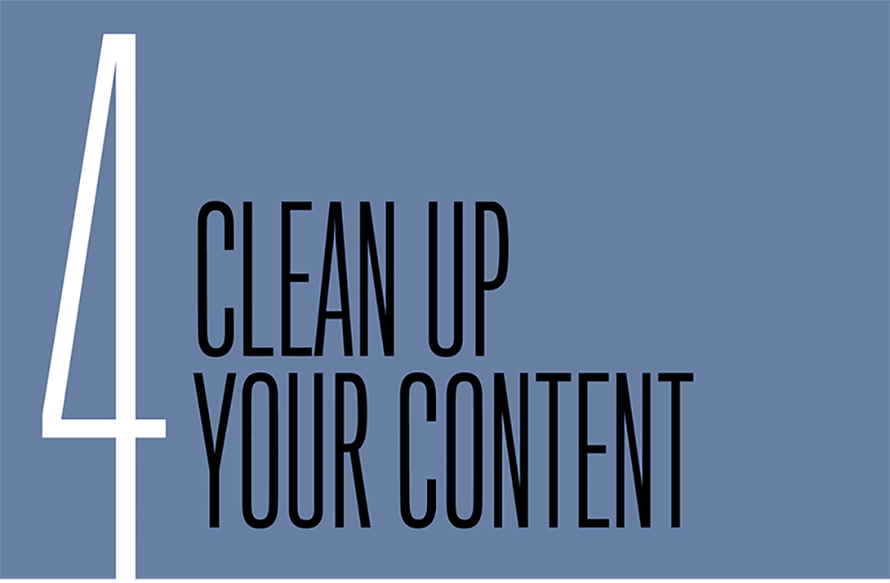
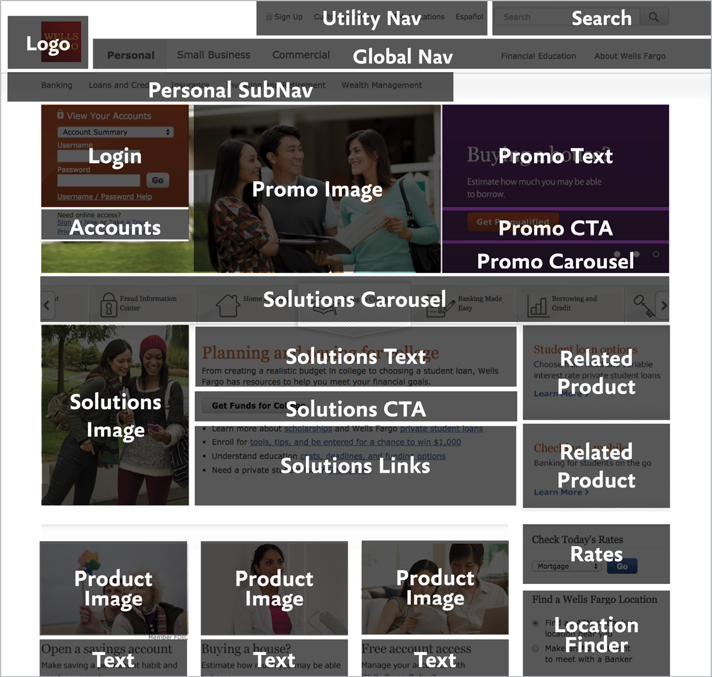
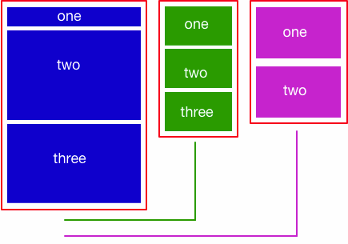
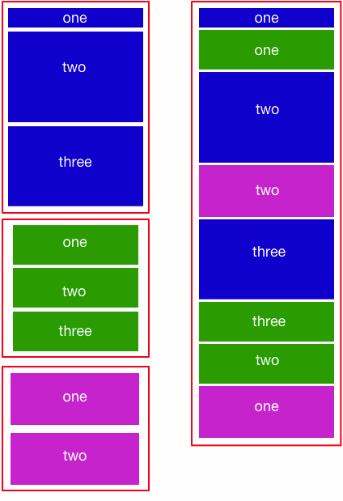

“The responsive design became a content solution and not just a technical solution to make the ongoing evolution of our digital products more robust.”

—ALEX BREUER, *The Guardian (*[http://bkaprt.com/gr/02-08/](http://bkaprt.com/gr/02-08/)*)*

FLUID GRIDS, flexible images, and media queries: nothing in the definition of responsive web design says anything about your content. And yet, a lasting benefit for many organizations comes from the process of cleaning up and paring down content.

It probably comes as no surprise that creating a good user experience across all devices means presenting less content, better content, and more thoughtfully prioritized content. Gone are the days when we could assume that users want (and look at) everything we cram onto the page and shove into the right column. Truth is, users *never* wanted all that dreck. Now, with smaller screens, we’re forced to acknowledge that uncomfortable truth and make decisions about what *really* matters.

Companies that show their “corporate underpants” by reflecting their organizational structure in their navigation will struggle to make the right choices, because decisions will still be grounded in stakeholder power structures rather than in customer needs. Companies that want to implement a genuinely user-centered approach will find a responsive redesign to be one of the best opportunities to do so.

The techniques for prioritizing, editing, and structuring content aren’t new—content strategists and user experience designers have long advocated for a more thoughtful approach to how content gets created, managed, and maintained. But content is time-consuming to edit and may require a lengthy review process. In light of other, competing priorities, cleaning up content often winds up at the bottom of the list.

I often describe mobile as a trojan horse that gives teams access to senior decision-makers and the power to make changes to content that might previously have been unattainable. Saying “you need to fix your editorial workflow” or “you need structured content” may not get the CEO’s attention—but saying “if you want your mobile website to succeed, you need to make these changes” may be just the argument that finally resonates.

Every responsive design project is also a content strategy project. Let’s look at how common content strategy processes can help you when you’re building a website that serves all devices.

## EDITORIAL PROCESSES

Like the stars of an episode of *Hoarders,* most companies suffer from an inability to let anything go. Team members feel daunted by the effort required to sift through the garbage piled in every corner of the page. It’s easier to use a giant shovel to dump the old content into new designs.

Teams that try this approach when implementing a responsive retrofit quickly find that they can’t avoid the content problem forever. Rob Huddleston from Capital One said that seeing the new responsive website was what finally made stakeholders realize they needed a new approach to content strategy:

> One thing that the retrofit did (not changing the desktop) was shine a big bright light on the content issues. People saw their content on a smaller device, saw what an overabundance of content there was and how unnecessary it was. Finally—it took a year—but we finally have business partners saying, “Okay, you were right, we need to think content first. Let’s redesign our site” ([http://bkaprt.com/gr/01-39/](http://bkaprt.com/gr/01-39/)).

Whether you’re cleaning up content after a responsive retrofit or proactively editing and structuring content to inform the design process, it’s time to take out the trash.

### Inventory and audit

Content strategists encourage starting with an inventory and audit of your content, and for good reason—you need to know what you’re working with to make informed decisions.

An inventory is an objective document that captures the facts about your content: what it’s called, when it was created, who owns it, and how big it is. It may also capture analytics data or information from search logs, which is especially useful as you move into the auditing stage. An audit is a subjective process in which you evaluate whether the content provides value and make choices about how to deal with it by editing it, deleting it altogether, or keeping it on the site as-is. (A complete guide to conducting an inventory and audit of your content is outside the scope of this book, but I cover the process in detail in *Content Strategy* *for Mobile*.)

One challenge with auditing and inventorying content to support a responsive design is that teams must gather more granular data. While typical content strategy processes focus on the *page* level, you’ll need to drill down to the module or chunk level to prioritize and structure your content. You’ll need to identify character or word counts for headlines, teasers, and body copy. You may also need to inventory image sizes and crop ratios. Understanding content at this level of granularity takes longer and requires more effort than simply shoving pages around, but it will help you make informed design decisions.

### Edit and restructure

While your design and development team is busy working through layouts and design patterns, writers and stakeholders can rewrite and reorganize the content. This editorial process can be one of the largest and most complex efforts in a responsive redesign, and often requires the following:

* hiring and managing teams of freelancers (hiring 10–20 copywriters in addition to full-time staff is not unheard of)
* training extended teams on appropriate style, voice and tone, and editorial practices
* reviewing content with subject matter experts, stakeholders, and legal or compliance teams
* migrating content from the current website into editing tools and prototypes, and then into the publishing system

I won’t gloss over the challenge of planning this work: even with careful processes and enough resources, it will take longer than you expect. Suzanne Connaughton, Web Strategy and Operations Manager at Children’s Hospital of Philadelphia, said they budgeted a year to revise their content, adding, “I feel like we still should have started earlier” ([http://bkaprt.com/gr/02-12/](http://bkaprt.com/gr/02-12/)). Justin McDowell, Web Designer at The Evergreen State College, said they thought their responsive redesign would be finished in July 2014, and as of April 2015 said:

> We are still working and we’re maybe halfway through because we want to make sure that the web pages are as good as they can be, and a lot of that has to do with retooling the content ([http://bkaprt.com/gr/04-01/](http://bkaprt.com/gr/04-01/)).

Consider a section-by-section staged rollout if you fear that fixing all your content will prevent the site from launching. (Revisit Chapter 2 for more information about planning your rollout strategy.) Be honest with yourself about the level of effort required for a massive content remediation project—but don’t underestimate the value you’ll receive from doing it.

When the time comes to begin rewriting content, you can make your team’s life easier (and get the job done more quickly) by using digital writing and editing tools.

### Use digital content tools

Designers have learned to use new tools and workflows as they adjust to the fluidity of responsive design. Rather than relying on fixed Photoshop comps, they evolve new ways to design and prototype. Writers and content reviewers must do the same.

“You will pry Microsoft Word from my cold, dead hands.” Even if content creators don’t tell me that directly, I can see it in their eyes. It’s like they have Stockholm Syndrome and have started identifying with their captors from the Microsoft Office suite of enterprise software.

Much like Photoshop does for design, Word and Excel constrain writers to an offline, print-centric model. Looking at real content in a prototype or publishing it on the web requires copying-and-pasting across multiple systems, often resulting in errors or version control problems. If writers expect to participate in an iterative design process, they must embrace digital tools.

Applications like Gather Content ([http://bkaprt.com/gr/04-02/](http://bkaprt.com/gr/04-02/)) and Draft ([http://bkaprt.com/gr/04-03/](http://bkaprt.com/gr/04-03/)) provide true digital writing and editing workflows. Even Google Docs offers a digital-first approach, without requiring a huge learning curve compared to Microsoft Word. Children’s Hospital of Philadelphia opted to do most of their writing and editing in an instance of their new Drupal CMS, which gave their content team on-the-job training and the chance to provide feedback on the author experience ([http://bkaprt.com/gr/02-12/](http://bkaprt.com/gr/02-12/)). The value in using these tools comes from a combination of flexibility and constraints:

* **Limited styles.** If you’ve ever tried to copy and paste from Microsoft Word into your CMS, you know it passes along a ton of garbage formatting that needs to be stripped out, especially when authors add their own formatting rather than using style sheets (like specifying 14pt Times New Roman Bold instead of `<h2>`.) If writers follow pre-defined styles (or better yet, use Markdown), designers and developers don’t waste time stripping and reformatting text as it moves between systems.
* **Structured content.** Content strategists often provide content templates in Word or Excel to guide content creators ([http://bkaprt.com/gr/04-04/](http://bkaprt.com/gr/04-04/)). Even better would be to use a digital authoring environment. Content creators can be given basic forms to complete with editorial guidelines inline. Structured content constrains and guides authors, and makes moving the content into the CMS easier.
* **Collaboration and version control****.** Online tools offer commenting and version control. Sure, everyone is comfortable using Track Changes in Word, but features like Suggesting mode in Google Docs provide an audit trail to show when and how changes were resolved.
* **APIs.** Want a trump card to play to argue against Word and Excel? Online tools have APIs that allow developers to pull content from one system to another. Want to see the most recent version of content in a prototype, or automatically migrate it into your CMS? Microsoft Word can’t do that, but web-based tools like Google Docs can.

### Less is more

Cleaning up and paring down content can massively reduce the number of pages on your site—a 75% reduction is not out of the question. Scott Childs, Experience Design Lead at Capital One, said that their responsive redesign was the tipping point that made stakeholders see the value of offering less (but better) content:

> We’re working on projects right now where different business units are redesigning their entire section of the site. We’re seeing page reductions of 60 to 70%. People are being really thoughtful about how we can get the most value out of content that is streamlined as much as possible ([http://bkaprt.com/gr/01-39/](http://bkaprt.com/gr/01-39/)).

Mike Donahue from Citrix consistently emphasized the value of starting with content, not with design, and said that aligning teams around a shared strategy for mobile content was what helped them focus:

> In our benefits section alone, we managed to cut 215 pages of content down to about twenty, because we sat with the HR team and we co-developed and co-created their content with them. When you can get people aligned on goals and strategies, you can have these open conversations and really whittle things down to just what you truly need ([http://bkaprt.com/gr/01-19/](http://bkaprt.com/gr/01-19/)).

Now, having fewer pages isn’t valuable for its own sake. The benefits come from a better user experience and reduced maintenance costs:

* **Improved navigation.** Fewer pages mean fewer levels of site navigation, which means it’s easier to browse and find what you’re looking for. Small screens are limited on space, but everyone benefits from simple navigation.
* **Easier to read.** The purpose and intent of each page becomes clear, as every element has to earn its keep.
* **Reduced costs.** Translation and content management costs add up. Mike Donahue from Citrix added, “There was some plain ol’ bottom dollar ROI to us getting better at doing the content” ([http://bkaprt.com/gr/01-19/](http://bkaprt.com/gr/01-19/)).

When you have less content, it’s easier to make sure valuable information gets seen. Prioritization exercises can help the team focus on what’s most important.

## CONTENT PRIORITIZATION

“Mobile first” has become such a buzzword that its definition has expanded to mean very different things to different people. At its core, mobile-first means using the constraints of a smaller, less-capable device to identify what matters most on each screen.

Perhaps the most valuable exercise for planning a content strategy and responsive redesign is a forced prioritization of objects on the page. This exercise is mobile-first made tangible. To make content and functionality work on the smallest screen sizes and least capable devices, stakeholders must make tough choices about what to keep and what to jettison. It’s best to do this in a work session—at least in the initial stages. Remember, every website redesign must include at least one brainstorming exercise where you move some Post-it notes around on the wall.

### Preparation

Get ready for your prioritization work session by identifying the pages and page elements you plan to discuss:

#### Understand user needs

This may sound painfully obvious, but you should know what users want and are looking for on your website before you come to the meeting. The books written about understanding user personas, goals, and tasks would fill a few library shelves, so if you’re still not sure how to make sense of user needs, now is the time to start. User research and analytics data should give you a working understanding of which content and features users find most valuable. A journey mapping exercise may be valuable to understand common user flows. Plan to share this data with your team during the session if they’re not familiar with it.

#### Select pages for discussion

You won’t be able to review every page on the website in a work session, so pick a subset of pages in advance. Make a list of high-value pages you’d like to discuss with your team: the homepage, key landing pages, product pages, most popular pages, or pages with complex layouts. Simple structures (like article pages) are relatively straightforward to prioritize, while landing pages that serve as a jumping-off point often require more discussion because they’re fraught with stakeholder politics. You’ll probably only be able to look at two or three pages in a work session, so focus on the ones that are most difficult, most read, and most valuable.

#### Identify content modules

For each page, list the content modules you plan to discuss in advance and document them in a spreadsheet for reference during the meeting. Unless you’re working only with team members responsible for content modeling and information architecture, it’s easiest to do this before your work session—that way you won’t spend the entire meeting debating 
how granular to make your modules and what to name them (FIG 4.1).

### In the work session

A prioritization work session can be a fun way to get team members talking about which elements on the page are most important to the customer. It can also be a frustrating exercise for people who’ve never had to make hard choices. Brian Greene, Creative Technologist at Nationwide, said stakeholders struggled with prioritizing elements on the screen:

> A forced prioritization is a challenge for some of our business partners because they’re so used to saying, “Contact us and log in are at the same level of importance.” We would force them: “No, you cannot do that. We need a number one, number two, number three” ([http://bkaprt.com/gr/04-05/](http://bkaprt.com/gr/04-05/)).

#### Rank the modules

Start the exercise by asking stakeholders to state in one sentence what the purpose of each page is. For some pages—like a product page—it should be obvious that the goal is to research or purchase the product. For others, it will quickly become clear that stakeholders have wildly competing interpretations of what the page is good for, or that no one understands its value to the user (FIG 4.2).

.")

Next, ask team members to physically order each element to reflect the purpose of the page. A few options for how to conduct this exercise:

* **Arrange Post-****it notes** labeled with the name of each module into a single stack column—no cheating by putting two Post-its side by side! This approach closely mimics the form factor of a smartphone and is useful if you want stakeholders to discuss potential layout tradeoffs.
* **Cut up printed screenshots** into modules using scissors and ask people to arrange them in a single column on the table. This approach works well as a pair or group exercise.
* **Print out large** **screenshots** of the current website and ask stakeholders to attach numbered dots to each element on the screen. This approach avoids going down the rabbit-hole of discussing layout and keeps the focus on actual priority. (Just because we expect the logo or the primary nav to appear at the top of the page doesn’t mean those elements are the most crucial for helping users complete their tasks.)
* **Display** **a spreadsheet** on the screen, where each worksheet represents one page, and each element appears on one row. Ask team members to rank the elements by assigning numbers. Ranking numerically by row means you can quickly reorder the list to get approval on the final prioritization. This approach works best when the team has comfortably completed a few examples using Post-its and is ready to move on to a faster process. (For distributed teams, you might share the spreadsheet in advance for people to 
complete on their own, then present an aggregated view of the rankings.)

#### Content choreography

Feeling good about your single-column forced prioritization? You haven’t gotten to the hard part yet. One of the more challenging aspects of a responsive redesign is maintaining visual hierarchy and priority as objects flow across different screen sizes (FIG 4.3). (Right about now, you may wish you were reading a book called *Going* *M-dot*.)

FIG 4.3: Three columns of a desktop website could simply stack on top of each other, but that doesn’t preserve the intended prioritization of objects. Content choreography ensures that the visual hierarchy makes sense as items shift between different breakpoints ([http://bkaprt.com/gr/04-08/](http://bkaprt.com/gr/04-08/)).

Paravel founder Trent Walton coined the phrase “content choreography” to describe the process of stacking or grouping elements across different screen widths ([http://bkaprt.com/gr/04-07/](http://bkaprt.com/gr/04-07/)). Managing these “in-between states” lies at the heart of a responsive design process, and developers have a variety of technical solutions to achieve it—using media queries, flexbox, or other emerging layout syntax.

Stakeholders and content owners should not expect to specify exact priority for every device type or breakpoint, but getting input on the relationships between content elements can help with complex layout decisions. Consider including some additional exercises in your work session:

* Give teams the option to arrange Post-its in either a single stack column or two side by side. Which elements do they believe are at the same level of importance?
* Ask teams to draw a box around elements that should be kept together as a group. Why do they group those elements and not others?
* Tell team members they can draw an X through any items they believe should be dropped from the page at smaller sizes but kept at larger sizes. Why do they think these elements aren’t always needed?

### Benefits of content prioritization

These prioritization exercises can be time-consuming and painful—and ultimately worth every minute. The results of these conversations can inform and improve:

* **editing**, by reducing or removing content deemed less valuable;
* **design and development**, by letting teams know which items should be more or less prominent;
* **site performance**, by ensuring that the most important elements load first.

When you prepared for your content prioritization exercise, you identified the content modules on the current site. That work will pay off when you develop a modular content structure for your responsive design. The process of breaking down content into smaller chunks is called *content* *modeling*.

## CONTENT MODELING

I’ve seen lots of web projects focus on designing page templates. Designers plan layouts using lorem ipsum text and boxes with an *X* in them. The people responsible for the content get handed a variety of different layouts and are told to fill in the boxes. As a result, there’s often a mismatch between the content and the design. That’s why content strategists insist that content planning be included early in the process.

That doesn’t mean that designers need to wait until every bit of content—every word, every picture—is gathered, written, edited, and approved. (If we worked that way, we’d never get anything done.) Rather, it means the team needs to have a shared understanding of the *structure* of the content before making decisions about templates and layouts.

### Structure before layout

Content modeling is the process of identifying the types of content you publish, as well as sizes and attributes of the content, before designing your templates. This process frees content from its page-jail, giving it more flexibility and fluidity.

While content modeling and responsive design are two separate and independent processes, they fit together nicely. Organizations looking to implement adaptive content will need to define a content model so they can create, test, and display variations. (I go over this process in detail in *Content* *Strategy for Mobile*.)

The benefit of content modeling for a responsive redesign is understanding the size and shape of the content components that will sit within its flexible grid. Rather than starting with page types and layouts, teams begin by defining:

* **Content types.** What types of content do you publish: products, articles, recipes, explainers? What’s the difference between an article and a blog post? I find that content creators are relieved to be given a chance to sit down and discuss what they create (and why) rather than jumping to how it will be presented on the website. Defining content types separate from page templates makes it more obvious that pieces of a particular content type can live on many different pages.
* **Content attributes.** I sometimes describe these as the “objects” that make up a content type: an article has a headline, a byline, a photo, and the article body. Defining the attributes of a content model separate from the data model in the CMS gives stakeholders a chance to weigh in on how they expect to create and reuse the content. It also gives designers and developers insight into the expected character count and data-type restrictions for each object.
* **Content relationships.** How will business rules and metadata be used to publish content dynamically? Too often, businesses copy and paste the same information on multiple pages, rather than storing content objects once in the CMS and publishing in multiple places. Defining dynamic content relationships is more efficient and less error-prone.

In the next chapter, I’ll describe how companies develop frameworks or pattern libraries for their design systems. Consider content modeling as the corollary to that process for your content and CMS.
